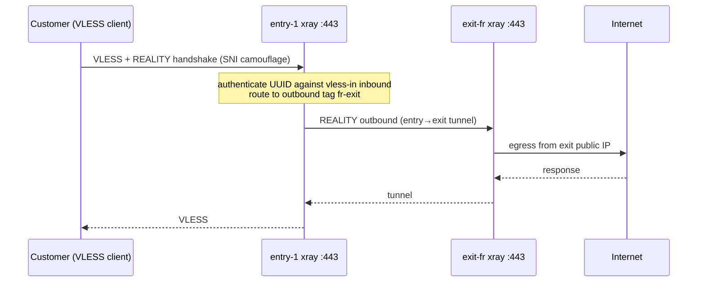
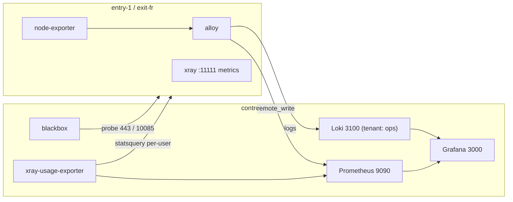

# Spirit VPN — Architecture & Administration Guide

This document describes the fleet **as it actually runs today**, and how to
administer it. Read [Security posture](#12-security-posture--hardening-state)
before making any firewall or hardening change.

> **One-line mental model:** this repo deploys the *application* (VPN data plane +
> observability + Vault + runtime-user management) **and** manages host hardening
> and exposure. The overlay-first hardening convergence is **done**: the firewall
> is codified (managed nftables on every host), SSH is key-only fleet-wide, and
> all management/telemetry/API surfaces are **overlay-only** — only `:443` (data)
> and `:22`/`:232` (key-only SSH) are public. The WireGuard overlay is live and
> **required** for management, though still hand-configured (its role is not yet
> un-stubbed). See [CONVERGENCE_STATUS.md](CONVERGENCE_STATUS.md) for the full
> state and [OPERATIONS.md](OPERATIONS.md) for the access/deploy model.

## Table of contents

1. [Fleet inventory](#1-fleet-inventory)
2. [Architecture diagrams](#2-architecture-diagrams)
3. [Logical layers](#3-logical-layers)
4. [The three planes](#4-the-three-planes)
5. [Container networking model](#5-container-networking-model)
6. [Firewalls & port exposure](#6-firewalls--port-exposure)
7. [WireGuard overlay](#7-wireguard-overlay)
8. [Administration — workstation setup](#8-administration--workstation-setup)
9. [Customer lifecycle](#9-customer-lifecycle)
10. [Deployment & change management](#10-deployment--change-management)
11. [Observability & usage](#11-observability--usage)
12. [Security posture & hardening state](#12-security-posture--hardening-state)
13. [Operational runbook (gotchas)](#13-operational-runbook-gotchas)
14. [Verification & health checks](#14-verification--health-checks)

---

## 1. Fleet inventory

Source of truth: `inventories/prod/inventory.yml`.

| Host | Role | Public IP | SSH | Purpose | Compose projects |
|---|---|---|---|---|---|
| `control-1` | platform / WG hub | `193.247.81.167` | `:22` | Vault + observability | `vault`, `observability` |
| `entry-1` | entry | `5.101.67.252` | `:232` | Customer-facing transit node | `vpn` |
| `exit-fr` | exit (country `fr`) | `151.247.196.239` | `:22` | France egress | `vpn` |
| `exit-nl` | exit (country `nl`) | `151.243.176.34` | — | **Disabled** (`node_enabled: false`) | — |

- Customer traffic terminates on `entry-1:443` and egresses via `exit-fr`.
- `entry_default_exit_tag: fr-exit` — customers route through `exit-fr` by default.
- `exit-nl` is declared-but-disabled; it is skipped, not deleted (lifecycle flag `node_enabled`).

---

## 2. Architecture diagrams

### Layered / host view

```mermaid
graph TB
    subgraph PROV["L7 · Provisioning — Ansible (app + codified firewall/SSH/exposure)"]
        ANS["make deploy · make reconcile · make decrypt · access.yml"]
    end

    CUST(["Customer"])
    NET(["Internet"])

    subgraph CTRL["control-1 · WG hub · 193.247.81.167"]
        CTRLc["Compose: observability + vault<br/>Prometheus 9090 · Loki 3100 · Grafana 3000<br/>Alertmanager 9093 · blackbox · xray-usage-exporter · Vault 8200"]
        CTRLnet["L3 net: bridge + DNAT (Docker ip nat table)"]
        CTRLfw["L5 fw: nftables — managed (overlay-only mgmt)"]
        CTRLc --- CTRLnet --- CTRLfw
    end

    subgraph ENTRY["entry-1 · 5.101.67.252 (ssh :232)"]
        ENTRYc["Compose vpn: xray :443 · nginx-mask :8443<br/>node-exporter · alloy · Xray API :10085"]
        ENTRYnet["L3 net: network_mode host (no NAT)"]
        ENTRYfw["L5 fw: nftables — managed (443 public, 10085 overlay)"]
        ENTRYc --- ENTRYnet --- ENTRYfw
    end

    subgraph EXIT["exit-fr · 151.247.196.239"]
        EXITc["Compose vpn: xray :443 · nginx-mask<br/>node-exporter · alloy · Xray API :10085"]
        EXITnet["L3 net: network_mode host (no NAT)"]
        EXITfw["L5 fw: nftables — managed (migrated off ufw)"]
        EXITc --- EXITnet --- EXITfw
    end

    CUST -->|"443 VLESS/REALITY · DATA"| ENTRYc
    ENTRYc -->|"REALITY tunnel · DATA"| EXITc
    EXITc -->|"egress · DATA"| NET

    ENTRYc -.->|"metrics 9090 / logs 3100 · TELEMETRY"| CTRLc
    EXITc -.->|"metrics / logs · TELEMETRY"| CTRLc

    ANS ==>|"SSH + Xray API 10085 · MGMT"| ENTRYc
    ANS ==>|"MGMT"| EXITc
    ANS ==>|"MGMT"| CTRLc

    WG{{"L4 · WireGuard overlay wg0 · 10.20.0.0/24 · hub-and-spoke · MGMT<br/>live + REQUIRED for management; hand-configured (role still stubbed)"}}
    CTRL --- WG
    ENTRY --- WG
    EXIT --- WG
```



Solid = **data plane** (must never break); dotted = **telemetry**; heavy `==>` = **management**.

### Data-plane flow



### Control / telemetry plane



---

## 3. Logical layers

| Layer | What | Managed by |
|---|---|---|
| **L7 Provisioning** | Ansible, reconcile loop, backend contract | repo (application only) |
| **L6 Host hardening** | sshd / fail2ban / sysctl / auditd / unattended-upgrades / deploy user | sshd **codified** (key-only, `deploy_mode`-gated); fail2ban/sysctl/auditd/deploy-user **deferred** |
| **L5 Firewall** | nftables (all hosts) | **codified** (`roles/common` + per-host `firewall.yml`); managed nftables fleet-wide (exit migrated off ufw) |
| **L4 Overlay** | WireGuard `10.20.0.0/24` hub-and-spoke | live + **required for management**; still **hand-configured** (`management_wireguard` role stubbed) |
| **L3 Container net** | host-mode (VPN nodes) vs bridge + DNAT (control-1) | repo (compose) |
| **L2 Containers** | Compose projects: `vpn` / `observability` / `vault` | repo |
| **L1 Hosts** | Ubuntu + Docker + kernel (nftables/wg/tc) | mixed |

---

## 4. The three planes

- **Data plane** — paying-customer traffic: `Customer → entry-1:443 → REALITY tunnel → exit-fr:443 → Internet`. Highest priority; never break it.
- **Management plane** — operator/automation reaching nodes: SSH (`root@…`, ports 22 / **232 for entry-1**, key-only) and the Xray gRPC API on `:10085`. The API is **overlay-only** (`wg0`, `10.20.0.0/24`); SSH is public but key-only (see [§6](#6-firewalls--port-exposure)).
- **Telemetry plane** — `entry-1`/`exit-fr` push metrics (`prometheus_remote_write`) and logs (`loki_ops_endpoint`) to the hub over the overlay (`telemetry_hub_host: 10.20.0.1`, ports `9090`/`3100`); blackbox on control probes `:443` (public) and `:10085` (over the overlay).

---

## 5. Container networking model

**This is the single most important operational distinction.** There are two models, and they behave differently under firewall changes:

- **VPN nodes (`entry-1`, `exit-fr`) use `network_mode: host`.** Containers share the host network namespace — no Docker bridge, **no DNAT**. Port 443 in the container *is* 443 on the host. These hosts have **no Docker NAT table to break**.
- **`control-1` uses bridge networking with published ports.** Prometheus/Grafana/etc. sit on a `172.x` bridge; Docker programs **DNAT** rules in nftables' `ip nat` table to forward host ports to container IPs.

**Consequence (learned the hard way):** on `control-1` only, a `flush ruleset` (or
`nft delete table ip nat`) wipes Docker's `ip nat` table, breaking every published
port until `systemctl restart docker` reprograms it. The **managed template avoids
this** — it uses an add+delete of only `inet filter`, never `flush ruleset`, so
Docker's NAT survives and no restart is needed. The `forward` chain also permits
Docker-bridge egress (`ip saddr 172.16.0.0/12 accept`, via
`common_docker_bridge_forwarding`) or bridge containers can't scrape/egress. See
[§13](#13-operational-runbook-gotchas).

---

## 6. Firewalls & port exposure

> **Codified and overlay-first.** The firewall is managed by Ansible on every
> host: `roles/common` renders `nftables.conf.j2` from a per-host profile
> (`inventories/prod/host_vars/<host>/firewall.yml`), gated by `deploy_mode` +
> `common_manage_firewall`. The engine is **nftables fleet-wide** (exit-fr was
> migrated off ufw). Only `:443` and SSH are public; management/telemetry/API are
> overlay-only.

Firewall engine per host — all **nftables, managed** (`/etc/nftables.conf`,
`nftables.service` enabled):

| Host | Engine | Profile |
|---|---|---|
| `control-1` | nftables (bridge/DNAT) | `host_vars/control-1/firewall.yml` |
| `entry-1` | nftables (host-net) | `host_vars/entry-1/firewall.yml` |
| `exit-fr` | nftables (host-net) | `host_vars/exit-fr/firewall.yml` |

**Current exposure** (after the C1/C2/C3 overlay-first rollback):

| Host | Port | Service | Exposure |
|---|---|---|---|
| entry-1 / exit-fr | 443 | VLESS/REALITY | **public** (data plane) |
| all | 22 / 232 | SSH | **public**, key-only (no source whitelist) |
| entry-1 / exit-fr | 10085 | Xray gRPC API | **overlay-only** (`wg0`, `10.20.0.0/24`) |
| control-1 | 9090 / 3100 | Prometheus / Loki | **overlay-only** (whole `/24` — nodes remote-write/push) |
| control-1 | 3000 / 9093 / 8200 | Grafana / Alertmanager / Vault | **overlay-only** (workstation `10.20.0.2`) |

**Editing the firewall (managed):** change the host's `firewall.yml`, dry-run,
then apply via `playbooks/harden.yml` with a dead-man auto-revert — never hand-edit
live. The managed template uses an add+delete idiom (not `flush ruleset`), so
Docker's `ip nat` survives and **no `docker restart` is needed**:

```bash
ansible-playbook -i inventories/prod/inventory.yml playbooks/harden.yml \
  -e deploy_mode=hardened -e common_manage_firewall=true --check --diff --limit <host>
# then re-run without --check, behind the dead-man switch (CONVERGENCE_STATUS.md §5)
```

Reach `control-1` over the overlay (`-e ansible_host=10.20.0.1`); its public `:22`
banner-hangs from the workstation. Restarting the `vpn` containers on
entry-1/exit-fr drops runtime users (see [§13](#13-operational-runbook-gotchas)).

---

## 7. WireGuard overlay

A hub-and-spoke overlay runs on the live hosts — `wg0`, `10.20.0.0/24`, hub =
`control-1` (`10.20.0.1`), spokes = entry/exit. After the overlay-first rollback
it is the **required** path for the management plane: the Xray API (`10085`),
telemetry ingest (`9090`/`3100`), and the operator's Grafana/Vault access are all
reachable **only** over it. Operate from a machine that is a `wg0` peer.

Peers: `control-1` `.1`, `entry-1` `.11`, `exit-fr` `.21`, operator workstation
`.2`, plus external/CI peers. The roster's public keys live in `operators` /
`management_wireguard_external_peers` (`group_vars/all.yml`).

**Codification status:** the `roles/management_wireguard` role is **still stubbed**
(`management_wireguard_enabled: false`; `make management` refuses), so the live
overlay is **hand-configured** — `make deploy` does not reconcile it. Un-stubbing
it (peers as data, zero-diff) is deferred; see [CONVERGENCE_STATUS.md](CONVERGENCE_STATUS.md).

---

## 8. Administration — workstation setup

Every `make` command runs from the repo root on the operator workstation.

```bash
cd /home/xvpaul/Desktop/spirit_vpn/infra_v1
source ../../venv/bin/activate     # ansible-core 2.18.x lives in this venv
sudo wg-quick up wg0               # join the management overlay (required to reach 10085/telemetry)
sudo systemctl start docker        # local Docker is used by xray-api/gen-client; it is NOT enabled on boot
make decrypt                       # materialize SOPS deploy secrets (needs your age key)
make deps                          # verify prerequisites
```

SSH is **key-only fleet-wide** (`SSH_AUTH=auto|key`, `SSH_KEY=…`); password auth is
disabled on every host. Reach `control-1` over the overlay (`-e ansible_host=10.20.0.1`)
— its public `:22` banner-hangs from the workstation. Access onboarding + the secrets
model are in [OPERATIONS.md](OPERATIONS.md).

Command reference (from `make help`):

| Task | Command |
|---|---|
| Show parsed inventory | `make inventory` |
| Ping all hosts (SSH+Python) | `make ping [LIMIT=host]` |
| Static checks (lint/syntax/render/dashboards) | `make check` |
| Full deploy + verify | `make deploy` |
| Deploy platform only (control-1) | `make platform [LIMIT=control-1]` |
| Re-run verification | `make verify` |
| Single-node redeploy (dry-run) | `make check-node LIMIT=entry-1` |
| Single-node redeploy (apply) | `make apply-node LIMIT=entry-1` |
| Rebuild entry→exit wiring | `make wire` |
| Certificates (ACME) | `make certs [LIMIT=control-1]` |

Xray runtime-user API (`NODE=entry-1` or `ENDPOINT=host:10085`):

| Task | Command |
|---|---|
| API reachable? | `make api-ping NODE=entry-1` |
| List users | `make api-list NODE=entry-1` |
| Exact user identifiers | `make api-emails NODE=entry-1` |
| Present? | `make api-has NODE=entry-1 EMAIL=<id>` |
| Add | `make api-add NODE=entry-1 UUID=<uuid> EMAIL=<id>` |
| Remove | `make api-remove NODE=entry-1 EMAIL=<id>` |
| Stats | `make api-stats NODE=entry-1 [PATTERN=<id>]` |

---

## 9. Customer lifecycle

**Runtime users are the backend's responsibility** (per `BACKEND_INTEGRATION.md`);
these commands are the equivalent repo operations for manual/testing use.

**Create a customer and issue a link:**

```bash
UUID=$(python3 -c 'import uuid; print(uuid.uuid4())')
EMAIL="customer-<stable-unique-id>"          # allowed chars: A-Za-z0-9 . _ @ : + -
make api-add   NODE=entry-1 UUID="$UUID" EMAIL="$EMAIL"
make gen-client NODE=entry-1 UUID="$UUID" EMAIL="$EMAIL" OUT=client.json
# gen-client prints a vless://… URI and writes a SOCKS client JSON
make api-has   NODE=entry-1 EMAIL="$EMAIL"   # exit 0 = present
```

**Remove a customer:**

```bash
make api-remove NODE=entry-1 EMAIL="$EMAIL"
```

**Check a customer's usage:** `make api-stats NODE=entry-1 PATTERN="$EMAIL"`
(cumulative bytes since the last Xray restart), or the **VPN Per-User Usage**
Grafana dashboard for top-talkers over time.

> **Runtime users are in-memory only.** A restart of the `vpn-xray-1` container
> (deploy, firewall change, crash) **wipes all API-added users**. Restore them
> with `make reconcile` (below) or they lose service. Their `vless://` link is
> keyed on the UUID, so re-adding the *same* UUID/EMAIL restores access without
> reissuing the link.

**Reconcile desired users after a restart** (idempotent; the backend's
authoritative user list should drive this):

```bash
make reconcile NODE=entry-1 STATE=/secure/desired-users.json          # add missing
make reconcile NODE=entry-1 STATE=/secure/desired-users.json PRUNE=1  # also remove unknown
```

State file format: see `BACKEND_INTEGRATION.md` (`{"users":[{"uuid","email","flow"}]}`).

---

## 10. Deployment & change management

- **Full pipeline:** `make deploy-e2e` runs static checks → full deploy →
  infrastructure/telemetry verification → customer E2E. Use for a full cutover.
- **Routine deploy:** `make deploy` (site.yml: preflight → platform → exits →
  wire → entries → client-metadata → verify). Idempotent.
- **Ordering matters:** exits deploy and produce REALITY client passwords →
  `wire` builds entry outbounds from them → entries deploy. `make wire`
  regenerates `inventories/prod/host_vars/<entry>/generated_exits.yml`.
- **Single node:** `make check-node LIMIT=<host>` (diff) then
  `make apply-node LIMIT=<host>`. Entries must already be wired.
- **Platform only:** `make platform` (Vault + observability on control-1).

After any deploy that restarts `vpn` containers, **reconcile runtime users** (§9).

---

## 11. Observability & usage

All on `control-1`, **overlay-only** (reach them as a `wg0` peer at `10.20.0.1`):

| Tool | URL (over the overlay) | Auth |
|---|---|---|
| Grafana | `http://10.20.0.1:3000` | `admin` / SOPS (`grafana_admin_password`, via `make decrypt`) |
| Prometheus | `http://10.20.0.1:9090` | overlay is the gate |
| Loki | `http://10.20.0.1:3100` | header `X-Scope-OrgID: ops` |

Provisioned Grafana dashboards:

- **VPN Fleet Overview** — reachability, CPU/mem/load, network throughput.
- **VPN Logs** — Loki log explorer (ops tenant).
- **VPN Per-User Usage** — top talkers by total bytes and by throughput
  (fed by `xray-usage-exporter`; see `CHANGELOG_V8.md`). Visibility only —
  durable quota accounting is the backend's job.

Note: adding a Prometheus **scrape job** (edit to `prometheus.yml`) requires a
Prometheus restart to load — the observability role now does this via a
`Restart Prometheus` handler. `file_sd` targets (`fleet-targets.yml`) auto-reload.

---

## 12. Security posture & hardening state

**Read this before any hardening or firewall change.** The overlay-first hardening
convergence is **done** and codified. Full state/decisions/gotchas live in
[CONVERGENCE_STATUS.md](CONVERGENCE_STATUS.md); the summary:

- **`deploy_mode` gate** (`runtime` | `bootstrap` | `hardened`) replaced the old
  unconditional tripwire. In `runtime` the `common_*` hardening flags must stay
  false; `bootstrap`/`hardened` enable the tasks.
- **Codified & live:** managed **nftables** firewall on every host (per-host
  `firewall.yml`, Docker-NAT-safe add+delete idiom), **key-only SSH** fleet-wide
  (`sshd-hardening.conf.j2`), and **overlay-only** exposure of `10085`/`9090`/
  `3100`/`3000`/`9093`/`8200` (only `:443` + SSH public). Applied host-by-host
  with dry-run + dead-man auto-revert + E2E gate.
- **Operator access** is codified: `operators` roster → `authorized_keys` via the
  scoped `playbooks/access.yml`; secrets are SOPS-encrypted (`make decrypt`).
- **Still deferred** (not yet codified): the `management_wireguard` role (overlay
  hand-configured), the Vault SSH CA, and fail2ban / sysctl / auditd /
  unattended-upgrades / `deploy` user. `tc-shaping.sh.j2` / `audit.rules.j2`
  remain orphaned.

Blocker-avoidance rules (still enforced for every host change):

1. Firewall tasks must include Docker-bridge egress and reconcile Docker on
   bridge hosts (control-1).
2. Prefer overlay-bound management/telemetry ports over the current public
   openings; update `verify.yml` to match.
3. Never drop the active admin path — apply → verify → commit, with rollback.
4. Reconcile runtime users after any Xray restart.
5. Extend verification to hardening invariants (SSH up, firewall loaded, wg up,
   Docker NAT intact, data-plane E2E passing).

---

## 13. Operational runbook (gotchas)

Real issues encountered operating this fleet, with fixes:

| Symptom | Cause | Fix |
|---|---|---|
| `ModuleNotFoundError: ansible` | venv not active | `source ../../venv/bin/activate` |
| `docker.sock: no such file` from `make api-*` | **local** Docker daemon down (not enabled on boot) | `sudo systemctl start docker` |
| Customer's link stops working after a deploy/restart | Xray runtime users are in-memory; container restart wiped them | `make reconcile …` or re-add same UUID/EMAIL |
| control-1 published ports all break after an `nft -f` reload | `flush ruleset` also wiped Docker's `ip nat` table | `systemctl restart docker` (reprograms NAT, keeps containers) |
| Prometheus can't scrape containers / blackbox probes fail after firewall change | `forward` chain missing Docker-bridge rule | add `ip saddr 172.16.0.0/12 accept` to forward chain |
| New Prometheus scrape job not picked up | Prometheus reads `scrape_configs` only at startup | restart Prometheus (role handler does this) |
| `entry-1` SSH "timed out during banner exchange" | transient network lag (host fine) | retry; SSH port is **232**, not 22 |
| `sudo: a password is required` in a play using `connection: local` | inventory `ansible_become: true` leaks onto localhost | set `ansible_become: false` in the play vars |

---

## 14. Verification & health checks

```bash
make verify                      # runtime + API + dashboards + logs + metrics, all hosts
make e2e-all ENTRY=entry-1       # provision throwaway user → connect → confirm egress via exit → cleanup
make api-ping NODE=entry-1       # Xray API reachable
```

Quick manual checks:

```bash
# data plane reachable (public :443)
for h in 5.101.67.252 151.247.196.239; do nc -z -w5 "$h" 443 && echo "$h:443 ok"; done
# telemetry healthy — over the overlay (must be a wg0 peer)
curl -s http://10.20.0.1:9090/-/ready
curl -s http://10.20.0.1:9090/api/v1/query?query=up | python3 -m json.tool
# per-user usage present
curl -s 'http://10.20.0.1:9090/api/v1/query?query=xray_user_traffic_bytes_total' | python3 -m json.tool
```

A healthy fleet: all `probe_success` = 1, node metrics present for every enabled
node, Loki has logs from every node, and `make e2e-all` passes end to end.

---

*See also: `BACKEND_INTEGRATION.md` (runtime-user contract), `CHANGELOG_V6…V8.md`
(recent changes), `governance/` (logging/data policy), `INFRASTRUCTURE_SPEC.md` /
`VPN_INFRASTRUCTURE_SPEC.md` (design intent).*
