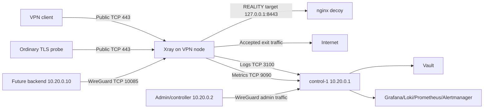

# Self-Hosted VPN Fleet Infrastructure

## Concepts, architecture, state, security, deployment, operations, and reproduction guide

**Repository documented:** `vpn-infra-wireguard-v4`  
**Document type:** beginner-to-operator technical specification  
**Date:** 13 July 2026  
**Primary technologies:** Linux, Ansible, WireGuard, nftables, Docker Compose, Xray, VLESS, REALITY, nginx, Vault, Grafana Alloy, Loki, Prometheus, Alertmanager, Grafana, Blackbox Exporter

---

## Document purpose

This document explains the infrastructure repository from first principles. It is written for a reader who does not yet have a mental model of servers, networking, configuration management, containers, VPN/proxy software, secret stores, or observability.

It serves four purposes:

1. Explain what “infrastructure” means and what problems infrastructure code solves.
2. Explain exactly what this repository deploys, where it runs, and how traffic and control operations flow.
3. Explain where configuration, credentials, persistent data, and runtime state live before and after deployment.
4. Show how to design and reproduce a similar infrastructure-as-code repository yourself.

This is both a **system specification** and a **learning guide**. It distinguishes:

- what the current repository actually implements;
- what the architecture intends to implement;
- what belongs to a future backend;
- what is still missing or should be corrected before a serious production launch.

---

# Part I — First principles

## 1. What infrastructure is

“Infrastructure” is the technical foundation on which an application or online service runs.

For this VPN service, the real infrastructure includes:

- virtual or physical servers;
- Linux operating systems installed on those servers;
- public and private IP addresses;
- network routes and firewalls;
- SSH access;
- WireGuard private-network interfaces;
- Docker and running containers;
- Xray and nginx processes;
- Vault and its encrypted data;
- log and metric storage;
- monitoring and alerting processes;
- certificates, cryptographic keys, service credentials, and configuration files.

Infrastructure is not only “the servers.” It includes everything required to make the servers useful, secure, reachable, observable, and repeatable.

### 1.1 Physical infrastructure versus infrastructure code

There are two related meanings of the word:

1. **Actual infrastructure** — the servers, networks, processes, files, keys, and persistent data that exist in the real environment.
2. **Infrastructure as Code, or IaC** — source files that describe how much of that infrastructure should be configured.

The repository is IaC. It does not itself carry network traffic. It tells Ansible how to configure real machines.

A useful analogy is:

```text
Architectural drawings     = infrastructure repository
Construction process       = Ansible execution
Building                   = configured servers
People and activity inside = running services and runtime state
```

Deleting the architectural drawings does not immediately delete the building. Similarly, deleting the Git repository does not immediately stop deployed servers. However, without the repository, reproducing, repairing, or safely changing the environment becomes much harder.

## 2. What problems infrastructure as code solves

Without IaC, an operator often configures servers manually:

```text
SSH into server 1
Install packages
Edit configuration files
Open ports
Start services
Repeat slightly differently on server 2
Forget one step
Lose track of which server differs
```

This creates “pet servers”: each machine becomes unique, poorly documented, and difficult to rebuild.

IaC addresses these problems.

### 2.1 Repeatability

The same code can configure many machines in the same way.

### 2.2 Reviewability

A configuration change can be reviewed as a Git diff before it reaches production.

### 2.3 Reproducibility

A failed server can be replaced and configured using the same repository.

### 2.4 Drift reduction

“Configuration drift” means the real server gradually differs from the intended configuration. Reapplying Ansible moves managed files and settings back toward the declared state.

### 2.5 Change history

Git records who changed what, when, and why.

### 2.6 Safer scaling

Adding a tenth node should be an inventory addition and controlled deployment, not a new sequence of undocumented manual steps.

### 2.7 Operational consistency

Every node can receive the same firewall policy, telemetry agent, Docker settings, directory permissions, and software versions.

### 2.8 Important limitation

IaC does not automatically make a design secure or correct. It makes the design repeatable. A mistake in IaC can repeat the same mistake everywhere. Review, testing, staged rollout, backups, and security analysis remain necessary.

## 3. What kind of IaC this repository is

This repository uses **Ansible**, which is primarily a configuration-management and orchestration system.

It assumes servers already exist and are reachable over SSH. It configures those servers.

It does **not** currently create cloud resources such as:

- virtual machines;
- provider VPCs;
- public IP addresses;
- DNS records;
- cloud load balancers;
- provider firewalls;
- object-storage buckets.

Those are commonly created with tools such as Terraform, OpenTofu, Pulumi, cloud-specific templates, or provider APIs.

Therefore, the current lifecycle is:

```text
Create VM manually or through a provisioning tool
                     ↓
Put its address and role in Ansible inventory
                     ↓
Run this repository to configure the VM
```

A complete infrastructure platform could later combine:

```text
Terraform/OpenTofu → create servers and provider network resources
Ansible             → configure operating systems and services
Backend             → manage customers and runtime Xray users
```

## 4. Where the infrastructure repository is stored

The repository should normally be stored in a private Git repository, for example GitLab or GitHub.

The Git repository should contain:

- playbooks;
- roles;
- templates;
- default policy;
- CI configuration;
- documentation;
- fake or placeholder inventory examples.

It should not contain unencrypted production secrets or a plaintext production inventory.

On an operator machine, it might exist at:

```text
/home/operator/projects/vpn-infra/
```

On a CI runner, it is checked out into a temporary CI workspace.

The active production inventory in this repository is expected at:

```text
inventories/prod/inventory.yml
```

That file is ignored by Git. If it must be stored in version control, it should be encrypted, for example with SOPS.

## 5. Where the infrastructure runs from

Ansible is agentless. There is no permanent Ansible daemon on each server.

Ansible runs from a **control node**, also called a controller. The controller can be:

- an administrator laptop;
- a secure operations VM;
- a self-hosted CI runner;
- a dedicated automation host.

The controller:

1. reads the repository;
2. reads the inventory;
3. connects to remote servers over SSH;
4. gathers facts about those servers;
5. uploads or renders temporary data;
6. executes modules and commands using Python and shell tools;
7. writes configuration files;
8. starts or restarts services;
9. exits.

After Ansible exits, the deployed services continue running independently.

```text
Ansible controller --SSH--> server
      executes changes
      then disconnects

Server keeps running Xray, WireGuard, Docker, Vault, and monitoring services.
```

## 6. The three kinds of state

Understanding state is essential.

### 6.1 Desired state

Desired state is what the repository and private inventory say should exist.

Examples:

- Xray should use image version `26.6.27`;
- the node should have WireGuard address `10.20.0.21`;
- port `10085` should be reachable only through `wg0` from backend addresses;
- `/opt/vpn/xray/config.json` should contain a particular base configuration.

### 6.2 Persistent actual state

Persistent actual state is stored on servers and survives process or machine restarts.

Examples:

- `/etc/wireguard/wg0.key`;
- `/var/lib/xray/reality.key`;
- `/opt/vpn/xray/config.json`;
- Vault Raft data under `/opt/vault/data`;
- Prometheus data in a Docker volume;
- Grafana’s database in a Docker volume.

### 6.3 Runtime state

Runtime state exists only while a process is running, unless another system records it.

Examples:

- Xray users added through HandlerService;
- Xray byte counters;
- current WireGuard handshakes and session keys;
- active TCP connections;
- in-memory caches;
- container process state.

A restart can erase runtime state even when persistent configuration remains unchanged.

This repository intentionally treats customer Xray users as runtime state. A future backend database must be their persistent source of truth and replay them after Xray restarts.

---

# Part II — Basic terminology

## 7. Server, host, machine, and node

These words are often used interchangeably, but context matters.

- **Server**: a machine providing services to other machines.
- **Host**: any machine represented in Ansible inventory or participating in a network.
- **Node**: one member of a distributed fleet or cluster.
- **VM**: a virtual machine supplied by a cloud or hosting provider.

In this document, a VPN node is a Linux server running Xray.

## 8. Process, service, container, and image

### Process

A process is a running program in Linux. It has a process ID, memory, open files, and network sockets.

### Service

A service is a long-running process managed by a supervisor such as systemd or Docker.

### Container image

An image is a packaged filesystem and metadata used to start containers. It is a template, not a running program.

Examples:

```text
ghcr.io/xtls/xray-core:26.6.27
grafana/loki:3.7.3
hashicorp/vault:2.0.3
```

### Container

A container is a running instance of an image. Containers share the host’s Linux kernel but receive isolated filesystems, namespaces, resource views, and configuration.

### Docker Compose

Docker Compose describes multiple related containers in a YAML file. It defines images, mounts, environment variables, ports, restart policy, health checks, and named volumes.

In this repository, Compose files are generated on the remote hosts under `/opt` and then applied by Ansible.

## 9. IP address, interface, port, and socket

### IP address

An IP address identifies a network endpoint. A server can have several addresses simultaneously.

Example VPN node:

```text
Public address:     203.0.113.21
WireGuard address:  10.20.0.21
Loopback address:   127.0.0.1
```

### Network interface

An interface is a Linux network device.

Examples:

```text
eth0   provider/public network interface
wg0    WireGuard management interface
lo     loopback interface
```

### Port

A port identifies a service within an IP address. TCP port `443` and TCP port `10085` are separate endpoints even on the same server.

### Socket

A listening socket is the kernel object through which a process receives network connections.

Examples:

```text
0.0.0.0:443         listen on port 443 on all IPv4 interfaces
10.20.0.21:10085    listen only on the WireGuard address
127.0.0.1:8443      listen only inside the local machine
```

## 10. Public, private, and loopback networking

### Public network

A public IP can be reached through the Internet, subject to firewalls and routing.

### Private management network

The WireGuard network uses addresses in `10.20.0.0/24`. These addresses are carried through encrypted tunnels between authorized peers. They are not globally routed on the Internet.

### Loopback

`127.0.0.1` means “this same machine.” A service bound only to loopback cannot be reached directly from another machine.

The repository uses all three boundaries:

```text
Public       → customer-facing Xray on 443
WireGuard    → Xray API and platform administration
Loopback     → nginx decoy and node_exporter
```

## 11. CIDR notation

CIDR notation combines an address and network prefix.

Examples:

```text
10.20.0.0/24    addresses from 10.20.0.0 through 10.20.0.255
10.20.0.21/32   exactly one address: 10.20.0.21
198.51.100.7/32 exactly one public address
```

A `/32` is useful in firewall rules and WireGuard peer routes because it identifies one IPv4 address.

## 12. DNS, hostname, SNI, and certificate

### DNS

DNS converts a name such as `vpn-nl.example.com` into an IP address.

### Hostname

A hostname is a human-readable name for a machine or service.

### SNI

Server Name Indication is a name carried in a TLS handshake so a server knows which hostname the client intends to reach.

### TLS certificate

A TLS certificate binds names or addresses to a public key. The corresponding private key proves the server controls that certificate identity.

The nginx decoy uses a conventional TLS certificate and key. REALITY uses a separate X25519 keypair and configuration; these are different cryptographic identities.

## 13. Control plane, management plane, and data plane

### Data plane

The data plane carries customer VPN traffic.

```text
Customer → public Xray port 443 → Internet or another Xray exit
```

### Management plane

The management plane carries operational traffic:

- Ansible SSH;
- backend-to-Xray API calls;
- logs and metrics;
- Vault and Grafana administration.

The WireGuard network is the principal management network.

### Control plane

“Control plane” is an overloaded term. In this repository, `control-1` is the platform server and initial WireGuard hub. It runs Vault and observability. A future application backend is also part of the broader service control plane, but it is not deployed by this repository.

---

# Part III — System overview

## 14. System boundaries

The repository configures existing Ubuntu/Debian-like Linux hosts.

It deploys:

- WireGuard management networking;
- Linux hardening and nftables;
- Docker Engine;
- Xray, nginx, Alloy, and node_exporter on VPN nodes;
- Vault and observability on the platform host.

It does not deploy:

- cloud VMs;
- DNS;
- provider firewalls;
- backend application code;
- backend database;
- customer accounts or billing;
- automated certificates;
- high availability.

## 15. Principal machine roles

### 15.1 Ansible controller

Runs the repository and reaches servers over public SSH during bootstrap and optionally through WireGuard later.

### 15.2 `control-1`

Acts as:

- the initial WireGuard hub at `10.20.0.1`;
- the Vault server;
- the observability server;
- the private administrative endpoint for Grafana, Prometheus, and Alertmanager.

### 15.3 Exit node

An exit node:

- accepts VLESS/REALITY connections on public TCP `443`;
- authenticates runtime or static UUIDs;
- sends accepted traffic to the Internet using Xray’s `freedom` outbound;
- exposes Xray’s API over WireGuard;
- sends logs and metrics to the platform.

### 15.4 Entry node

An entry node:

- accepts customer connections on public TCP `443`;
- can forward traffic to configured exit nodes through VLESS/REALITY outbounds;
- blocks unmatched entry traffic if configured;
- exposes its API over WireGuard.

### 15.5 Future backend

The backend is not part of this repository. It will:

- persist customer and device data;
- create UUIDs;
- add and remove runtime users through Xray HandlerService;
- query StatsService;
- reconcile state after Xray restarts;
- generate client configurations;
- enforce business rules.

There is no node agent in this architecture.

## 16. Network-plane diagram



ASCII equivalent:

```text
PUBLIC INTERNET
    ├── TCP 443 → Xray VLESS/REALITY
    │                ├── accepted traffic → direct Internet or exit route
    │                └── REALITY target → local nginx 127.0.0.1:8443
    │
    └── UDP 51820 → WireGuard hub only

WIREGUARD 10.20.0.0/24
    ├── backend → node:10085 Xray gRPC API
    ├── node → control-1:3100 Loki
    ├── node → control-1:9090 Prometheus remote write
    └── admin → control-1:8200/3000/9090/9093
```

## 17. Port matrix

| Endpoint | Protocol | Bind scope | Purpose | Intended callers |
|---|---:|---|---|---|
| VPN node `:443` | TCP | `0.0.0.0` | Xray VLESS/REALITY public service | customers and public probes |
| VPN node `:8443` | TCP | `127.0.0.1` | nginx TLS decoy target | local Xray only |
| VPN node `:9100` | TCP | `127.0.0.1` | node_exporter metrics | local Alloy only |
| VPN node `:10085` | TCP | WireGuard IP | Xray gRPC API | backend/controller allowlist |
| Hub `:51820` | UDP | public interface | WireGuard tunnel endpoint | WireGuard peers |
| Platform `:8200` | TCP/TLS | WireGuard IP | Vault API and UI | admins/backend |
| Platform `:8201` | TCP/TLS | WireGuard IP | Vault cluster traffic | future Vault peers; not opened by current firewall |
| Platform `:3000` | TCP | WireGuard IP | Grafana | admins/backend as allowed |
| Platform `:3100` | TCP | WireGuard IP | Loki ingestion/query API | nodes and Grafana |
| Platform `:9090` | TCP | WireGuard IP | Prometheus UI/API and remote-write receiver | nodes and admins according to firewall group |
| Platform `:9093` | TCP | WireGuard IP | Alertmanager UI/API | admins |
| Blackbox `:9115` | TCP | Docker network only | probe service | Prometheus container |
| All hosts `:22` | TCP | public/private according to routing | SSH | administrator CIDRs |

---

# Part IV — Ansible and repository concepts

## 18. Inventory

An Ansible inventory defines which hosts exist and how they are grouped.

The active inventory is:

```text
inventories/prod/inventory.yml
```

The example is:

```text
examples/inventory.yml
```

Groups in this repository include:

- `management_network`;
- `platform`;
- `entry`;
- `exit`;
- country groups such as `country_nl`.

A host can belong to several groups. For example, `exit-nl-1` belongs to:

```text
management_network
exit
country_nl
```

This lets policies be layered by function and geography.

## 19. Variables and precedence

Variables customize behavior without duplicating tasks.

Sources include:

- role defaults;
- committed group variables;
- private inventory variables;
- host-specific variables;
- play variables;
- command-line extra variables.

Examples:

```yaml
xray_image: ghcr.io/xtls/xray-core:26.6.27
xray_api_bind: 10.20.0.21
country: nl
management_wireguard_address: 10.20.0.21/32
```

The repository deliberately keeps policy such as image versions in committed group variables and environment-specific addresses/secrets in the gitignored inventory.

## 20. Playbook

A playbook is an ordered set of plays. A play selects hosts, defines variables, and applies roles or tasks.

The main playbooks are:

```text
playbooks/management-network.yml
playbooks/platform.yml
playbooks/fleet-infra.yml
```

`site.yml` is intentionally disabled so that an operator cannot casually deploy everything in one unsafe operation.

## 21. Role

A role groups reusable defaults, tasks, templates, and handlers.

Typical structure:

```text
roles/example/
├── defaults/main.yml
├── tasks/main.yml
├── templates/
└── handlers/main.yml
```

This repository uses roles to separate concerns. For example, the Docker role installs Docker but does not own the VPN stack.

## 22. Task

A task performs one operation, such as:

- install a package;
- create a directory;
- render a template;
- start a service;
- assert that a variable is valid.

Ansible modules try to be idempotent: they report “changed” only when the target must be modified.

## 23. Handler

A handler runs only when notified by a changed task. It is commonly used to restart or reload services after configuration changes.

Example intent:

```text
Xray config changed → notify “Restart Xray service”
```

Handler ordering and first-deployment behavior must be tested carefully; a handler can fail if it tries to restart a service before Compose has created that service.

## 24. Template

Jinja templates combine static text and variables to produce remote configuration files.

Examples:

```text
roles/xray/templates/config.json.j2
roles/common/templates/nftables.conf.j2
roles/management_wireguard/templates/wg0.conf.j2
```

The rendered result, not the template itself, is consumed by Xray, nftables, or WireGuard.

## 25. Facts

Ansible facts are data discovered from a host, such as:

- operating-system family;
- network interfaces;
- IP addresses;
- architecture.

The playbooks use facts to verify that `wg0` and the configured WireGuard address exist before binding platform or Xray services to them.

## 26. Check mode, diff mode, and staged rollout

### Check mode

`--check` asks Ansible to predict changes without applying them. Some shell commands and first-time generated secrets cannot be fully simulated.

### Diff mode

`--diff` shows changes to managed files. Secret-bearing tasks disable diff and logging.

### `serial`

The fleet play uses a percentage batch size. This limits simultaneous changes so the whole fleet is not restarted at once.

---

# Part V — WireGuard management network

## 27. Why WireGuard is present

Xray’s gRPC management API has no application-level authentication configured here. Vault and monitoring APIs also should not be publicly exposed.

WireGuard creates an encrypted private overlay network between trusted infrastructure participants.

It provides:

- encrypted transport over the public Internet;
- private addresses independent of hosting provider;
- peer identity based on public keys;
- a stable network path for internal APIs and telemetry;
- a narrow firewall boundary.

WireGuard does not carry customer VPN traffic in this design.

## 28. WireGuard concepts

### 28.1 Peer

Every WireGuard participant is a peer. A peer has a private key and corresponding public key.

### 28.2 Private key

The private key proves identity and must remain secret.

Managed-host keys are generated at:

```text
/etc/wireguard/wg0.key
```

### 28.3 Public key

The public key may be shared with other peers and is stored at:

```text
/etc/wireguard/wg0.pub
```

### 28.4 Endpoint

An endpoint is the public address where a peer can initially be contacted.

Only the hub needs a fixed public endpoint in the current topology:

```text
CONTROL_PUBLIC_IP:51820
```

### 28.5 AllowedIPs

`AllowedIPs` has two related roles:

- it tells WireGuard which destination addresses should be sent to a peer;
- it identifies which source addresses are accepted as belonging to that peer.

The hub gives each peer a unique `/32`. Spokes route the full management subnet to the hub.

### 28.6 PersistentKeepalive

Spokes send periodic keepalive packets so NAT and firewall state remains usable. The repository uses 25 seconds.

## 29. Hub-and-spoke topology

```text
                       control-1
                       10.20.0.1/24
                       UDP 51820
                    /       |       \
                   /        |        \
       controller peer   exit-nl-1   entry-de-1
        10.20.0.2/32     .21/32      .22/32
```

A packet from `10.20.0.2` to `10.20.0.21` travels:

```text
controller wg0
  → encrypted tunnel to control-1
  → Linux forwarding on control-1
  → encrypted tunnel to exit-nl-1
  → exit-nl-1 wg0
```

The hub enables IPv4 forwarding. nftables permits forwarding from `wg0` back to `wg0` within the management CIDR.

## 30. Why the management play cannot be limited

The hub configuration contains every active peer. If Ansible rendered the hub while only one host was selected, it could accidentally remove every unselected peer.

The role asserts that all members of `management_network` are present in the play.

Correct:

```bash
make management
```

Rejected:

```bash
make management LIMIT=exit-nl-1
```

## 31. WireGuard key-generation flow

For managed hosts, the role:

1. installs WireGuard tools;
2. creates `/etc/wireguard` with mode `0700`;
3. generates a private/public keypair if absent;
4. reads key material into Ansible facts;
5. renders `wg0.conf`;
6. enables `wg-quick@wg0`;
7. verifies the local address exists.

The private key is not stored in inventory, but the current implementation does transfer it through the Ansible controller process using `slurp` so it can render the inline `PrivateKey` field. `no_log` prevents normal output, but a stricter design would use a mechanism such as systemd-networkd `PrivateKeyFile` so the private key never leaves the node even transiently.

## 32. External peers

The controller and future backend may not be Ansible-managed hosts. Their keypairs are generated locally with:

```text
scripts/wireguard-peer.sh
```

Their private keys remain under:

```text
.local-secrets/wireguard/PEER_NAME/
```

Only their public keys and allowed `/32` addresses are added to the hub inventory.

## 33. WireGuard persistent and runtime state

Persistent:

```text
/etc/wireguard/wg0.key
/etc/wireguard/wg0.pub
/etc/wireguard/wg0.conf
```

Runtime kernel state:

- current peer endpoints;
- latest handshake times;
- transmit/receive counters;
- ephemeral session keys;
- routes created by `wg-quick`.

Inspect runtime state with:

```bash
sudo wg show
ip -br address show wg0
ip route
```

---

# Part VI — Linux host configuration and firewall

## 34. SSH bootstrap

Ansible initially uses the provider-created account, commonly `ubuntu`.

The common role creates a separate deployment account:

```text
deploy
```

It:

- installs configured SSH public keys;
- adds the user to `sudo`;
- grants passwordless sudo;
- disables root SSH login;
- disables password and keyboard-interactive authentication;
- allows only the deployment and initial Ansible users.

SSH host-key checking is enabled in `ansible.cfg`, protecting against unnoticed host-identity changes.

## 35. Linux hardening components

The common role installs and enables:

- `chrony` for clock synchronization;
- `auditd` for security audit events;
- `nftables` for host firewalling;
- `fail2ban` package/service;
- unattended security upgrades;
- selected kernel `sysctl` controls.

It also creates a hardened sshd drop-in and a deployment sudo rule.

## 36. sysctl

`sysctl` changes Linux kernel parameters.

The repository configures settings related to:

- reverse-path filtering;
- SYN-cookie protection;
- disabling redirects;
- disabling source routing;
- limiting ptrace behavior.

The WireGuard hub separately enables:

```text
net.ipv4.ip_forward = 1
```

because it must route packets between peers.

## 37. nftables mental model

nftables evaluates packets through chains.

### Input chain

Packets addressed to this server.

### Forward chain

Packets being routed through this server to another host.

### Output chain

Packets created by this server.

The repository uses:

```text
input policy  = drop
forward policy = drop
output policy = accept
```

It then explicitly allows:

- established/related traffic;
- loopback;
- rate-limited ICMP;
- SSH from configured CIDRs;
- public TCP services such as Xray `443`;
- WireGuard UDP on the hub;
- restricted management services only through `wg0` from configured CIDRs;
- management forwarding on the hub.

## 38. Firewall examples

VPN node:

```text
Allow TCP 443 from anywhere
Allow TCP 22 from admin CIDRs
Allow TCP 10085 only if:
  incoming interface is wg0, and
  source is an allowed controller/backend CIDR
Drop other inbound traffic
```

Platform:

```text
Allow UDP 51820 publicly because it is the WireGuard hub
Allow logs/metrics ports on wg0 from ingest CIDRs
Allow Vault/Grafana/Alertmanager on wg0 from admin CIDRs
Do not open those ports publicly
```

## 39. Current firewall caveat

The template starts with:

```text
flush ruleset
```

This removes the entire nftables ruleset, including tables created by other software such as Docker. During an initial deployment, the common role runs before Docker and Docker can recreate its own rules. On later firewall reloads, however, this may break Docker bridge networking and published platform ports until Docker is restarted.

A stronger production implementation should own a dedicated nftables table and avoid globally flushing rules created by other systems.

## 40. Current audit and fail2ban caveats

The audit template watches both `/opt/vpn` and `/opt/vault` on every host. Those paths may not exist when audit rules are first loaded or may be irrelevant to that host role. Role-specific directories and audit rules should be created before audit reload.

Fail2ban is installed and started, but the repository does not define an explicit jail. Operators should not assume effective SSH banning until `fail2ban-client status` confirms an enabled jail.

---

# Part VII — Docker and Compose

## 41. Why containers are used

Containers make application versions and filesystem dependencies more reproducible. Instead of installing each application directly into the host OS, the repository runs packaged images.

Host responsibilities remain:

- kernel;
- networking;
- firewall;
- Docker daemon;
- persistent host files;
- storage and backups.

## 42. Docker daemon configuration

The Docker role installs `docker.io` and Compose v2, enables Docker, and writes:

```text
/etc/docker/daemon.json
```

Configured behavior includes:

- the `local` log driver;
- bounded log size and file count;
- live restore;
- daemon-level no-new-privileges default;
- disabled userland proxy.

## 43. Bind mounts versus named volumes

### Bind mount

A host path is mounted into a container.

Example:

```text
/opt/vpn/xray/config.json → /etc/xray/config.json inside Xray
```

The operator can see and back up the host file directly.

### Named volume

Docker manages a persistent storage area.

Examples:

```text
vpn_alloy-data
observability_prometheus-data
observability_grafana-data
```

Named volumes survive container replacement but remain tied to the host unless backed up or migrated.

## 44. Host networking

VPN-node containers use:

```yaml
network_mode: host
```

This means they share the host network namespace.

Consequences:

- Xray can bind directly to public `443` and WireGuard `10085`;
- nginx can bind directly to `127.0.0.1:8443`;
- node_exporter can bind directly to `127.0.0.1:9100`;
- there is no Docker port-mapping layer for these services;
- container network isolation is reduced.

## 45. Container hardening controls

The VPN stack uses several controls:

- read-only root filesystems for Xray, nginx, and node_exporter;
- `no-new-privileges`;
- dropped capabilities;
- temporary filesystems for writable runtime paths;
- read-only configuration mounts;
- health checks;
- bounded Docker logs.

### Important current defect: privileged port capability

Xray is configured to listen on port `443`, but its container drops all Linux capabilities. Binding a port below `1024` normally requires `CAP_NET_BIND_SERVICE`. Unless the host changes the unprivileged-port threshold, the current container may fail to bind `443`.

The Compose definition should normally add:

```yaml
cap_add:
  - NET_BIND_SERVICE
```

or deliberately configure an equivalent host kernel policy. This must be tested on a real node before production use.

### Important Docker-socket risk

Alloy mounts `/var/run/docker.sock` to discover container logs. Marking a Unix socket mount read-only does not provide a true read-only Docker API. A compromised Alloy process may gain substantial control over Docker. A safer log architecture would use a restricted socket proxy, journald integration, or another collection method.

---

# Part VIII — Xray, VLESS, REALITY, and nginx

## 46. What Xray is in this system

Xray is the main customer-facing proxy engine.

It handles:

- public inbound connections;
- VLESS UUID authentication;
- REALITY transport security/camouflage;
- routing;
- direct Internet egress on exits;
- chained Xray outbounds on entries;
- runtime user management through its API;
- traffic counters.

This is not a conventional Layer-3 VPN that creates a client-side IP interface like WireGuard. It is an application proxy transport. Client applications normally send traffic through a local SOCKS or similar client proxy.

## 47. VLESS

VLESS is the proxy protocol used between Xray clients and servers.

In this repository:

- a client authenticates with a UUID;
- encryption is provided by REALITY/transport security rather than the VLESS protocol field;
- the flow is `xtls-rprx-vision`;
- the server inbound tag is `vless-in`.

## 48. REALITY

REALITY is the transport security/camouflage mechanism.

Server configuration includes:

- an X25519 private key;
- accepted server names;
- short IDs;
- a destination such as `127.0.0.1:8443`;
- TCP transport.

Client configuration includes:

- server public key;
- server name;
- short ID;
- fingerprint;
- UUID.

REALITY identity is separate from the nginx TLS certificate.

## 49. REALITY key lifecycle

If `reality_private_key` is empty, Ansible generates a private key on the node and stores it at:

```text
/var/lib/xray/reality.key
```

The key is then embedded in the rendered Xray configuration:

```text
/opt/vpn/xray/config.json
```

Both files are root-only.

The private key is persistent. If it is lost and regenerated, the public key changes and every client or entry referencing the old public key must be updated.

## 50. nginx decoy

nginx listens only at:

```text
127.0.0.1:8443
```

It serves a simple TLS page, currently containing `vmshare` by default.

Xray’s REALITY destination points to this local service. nginx is not directly bound to the public IP.

WireGuard does not remove or hide the public Xray listener. The paths remain:

```text
Public IP:443       → Xray
WireGuard IP:10085  → Xray API
127.0.0.1:8443      → nginx decoy
```

The exact behavior of arbitrary non-REALITY TLS probes is governed by Xray REALITY behavior; this should be tested with the chosen server name and certificate rather than assumed to behave exactly like a conventional nginx reverse proxy.

## 51. Xray inbound

The base configuration creates one public inbound:

```text
listen:   0.0.0.0
port:     443
protocol: vless
tag:      vless-in
security: reality
```

Its persisted client list comes from:

```yaml
xray_static_clients: []
```

Customer users should not be placed there. They are intended to be added through the runtime API.

## 52. Xray outbounds

Every node has:

- `direct` using the `freedom` protocol;
- `block` using the `blackhole` protocol.

An entry can also have one or more VLESS/REALITY exit outbounds from `entry_exits`.

## 53. Exit routing behavior

An exit:

- blocks private destination IP ranges using `geoip:private`;
- optionally blocks configured domain categories;
- otherwise uses the direct Internet outbound.

The exit group currently configures public DNS resolvers and `IPIfNonMatch` domain strategy. Operators should understand that DNS resolution and destination metadata have privacy and policy consequences.

## 54. Entry routing behavior

An entry renders a route for each configured exit:

```text
user email selector → outbound tag for an exit
```

A final catch-all rule blocks unmatched traffic.

This prevents a fail-open route to an unintended country.

### Current multi-hop limitation

The template contains one `email` selector per `entry_exits` item. Xray statistics also use email as the per-user key. A shared route-selector email would merge accounting, while unique emails require a routing rule for each user or a different routing design.

Only HandlerService and StatsService are enabled by default, not RoutingService. Therefore, the current repository is ready for direct runtime users on exits, but high-scale dynamic multi-hop customer routing requires an additional backend/infrastructure design.

## 55. Xray API

When enabled, Xray listens on:

```text
NODE_WIREGUARD_IP:10085
```

Services:

- `HandlerService` — add/remove users and alter inbounds;
- `StatsService` — query traffic counters.

The API is plaintext gRPC in this design. It is protected by:

- binding only to the WireGuard address;
- nftables source and interface restrictions;
- the cryptographic membership boundary of WireGuard.

For stronger defense in depth, add mTLS or an authenticated proxy later.

## 56. Runtime user state

A customer added through the API exists only in the running Xray process.

It does not automatically appear in:

```text
/opt/vpn/xray/config.json
Vault
Ansible inventory
Git
```

After Xray restarts, runtime users disappear.

The future backend must implement:

```text
Database desired state
      ↓
Add users to Xray after startup
      ↓
Periodically reconcile expected versus actual state
```

## 57. Traffic statistics

The configuration enables per-user uplink and downlink counters.

Counters are keyed by `email`, for example:

```text
user>>>accounting-id>>>traffic>>>uplink
user>>>accounting-id>>>traffic>>>downlink
```

A unique email-like accounting identifier is therefore important even if it is not a real email address.

Counters are runtime state and can reset on restart. The backend must poll and persist deltas carefully to avoid losing or double-counting usage.

---

# Part IX — Vault

## 58. What Vault is

Vault is a secret-management service. It can store and issue sensitive values under access-control policies.

Examples of appropriate Vault secrets:

- backend database credentials;
- API signing keys;
- provider API tokens;
- telemetry credentials;
- certificate-issuance credentials;
- backend application secrets.

Vault does not automatically manage Xray customer users. Xray users belong to the backend database and Xray API lifecycle.

## 59. Vault deployment

Vault runs as a container on `control-1`.

Host layout:

```text
/opt/vault/
├── compose.yml
├── config/vault.hcl
├── config/policy-backend.hcl
├── tls/vault.crt
├── tls/vault.key
├── data/
├── audit/
├── snapshots/
├── vault-init.sh
├── vault-unseal.sh
└── vault-bootstrap.sh
```

Vault uses:

- TLS 1.3 minimum;
- integrated Raft storage;
- memory locking;
- file audit logging;
- KV v2 at `secret/` after bootstrap;
- AppRole authentication for the future backend.

## 60. Vault initialization

Initialization prepares an empty Vault storage backend and creates root security material.

The helper runs:

```text
5 key shares
3-share threshold
initial root token
```

Initialization must happen once per new Vault storage backend.

The JSON output must be captured into secure storage outside the Vault server.

## 61. Seal and unseal

Vault encrypts stored data with a master encryption key. In the Shamir configuration, that key is protected by multiple unseal shares.

After Vault starts, it is sealed. Three different shares are required to unseal it.

Sealed Vault:

- cannot serve normal secret operations;
- keeps encrypted storage inaccessible;
- can report limited health/status.

This repository does not configure automatic unseal.

## 62. Vault bootstrap

The bootstrap script:

1. enables file audit logging;
2. enables the KV v2 secrets engine at `secret/`;
3. enables AppRole authentication;
4. writes a `backend` policy;
5. creates a `backend` AppRole.

The policy permits read/list access to:

```text
secret/backend/*
```

It does not seed application secrets.

## 63. AppRole concepts

AppRole is a machine-authentication method.

Simplified flow:

```text
Backend has role_id + short-lived secret_id
             ↓
Backend logs in to Vault
             ↓
Vault returns a limited token
             ↓
Backend reads only paths permitted by policy
```

Current role settings include:

- token TTL 15 minutes;
- token maximum TTL 1 hour;
- SecretID TTL 10 minutes;
- SecretID single use.

The repository does not automatically deliver a SecretID to the backend.

## 64. Vault persistent state

Vault’s encrypted data lives at:

```text
/opt/vault/data
```

The TLS key lives at:

```text
/opt/vault/tls/vault.key
```

Audit records live at:

```text
/opt/vault/audit/audit.log
```

Initialization shares and the initial root token live wherever the operator stores the initialization output, normally outside the server.

## 65. Vault production limitations

Current limitations include:

- single Vault node;
- manual unseal;
- no automated snapshot schedule;
- no tested off-host restore workflow;
- no audit-log rotation configured;
- no certificate renewal automation;
- `/opt/vault/snapshots` exists but is not mounted into the container in the current Compose file;
- the helper uses the server certificate path as `VAULT_CACERT`, which must be tested with the chosen certificate chain.

A serious production system should use multiple Vault nodes, automated or carefully operated unseal, scheduled off-host snapshots, restoration drills, and certificate lifecycle automation.

---

# Part X — Observability

## 66. What observability means

Observability is the ability to understand system health from emitted data.

Three common signal types are:

- **metrics** — numeric time series such as CPU usage or probe success;
- **logs** — timestamped events and messages;
- **traces** — request paths across distributed services.

This repository deploys logs and metrics, not distributed tracing.

## 67. Component roles

### Alloy

Runs on every VPN node. It collects container logs, scrapes node_exporter, and sends data to the platform.

### node_exporter

Exposes Linux host metrics locally at `127.0.0.1:9100`.

### Loki

Stores and queries logs.

### Prometheus

Stores metrics, evaluates alert rules, and scrapes the Blackbox Exporter.

### Blackbox Exporter

Attempts TCP connections to public VPN endpoints to test reachability.

### Alertmanager

Groups, deduplicates, silences, and routes alerts.

### Grafana

Provides the human interface for exploring metrics and logs.

## 68. Log flow

```text
VPN containers
   ↓ Docker logging
Docker socket discovery by Alloy
   ↓ labels: node, role, country, container
Loki HTTP push over WireGuard
   ↓ tenant: ops
Loki filesystem storage
   ↓
Grafana Explore
```

Alloy keeps only containers whose Docker Compose project label is `vpn`.

## 69. Metric flow

```text
Linux host
   ↓
node_exporter 127.0.0.1:9100
   ↓ local scrape
Alloy
   ↓ Prometheus remote write over WireGuard
Prometheus :9090
   ↓
Grafana and alert rules
```

## 70. Blackbox flow

Prometheus reads public `:443` endpoints generated from inventory and asks Blackbox Exporter to attempt a TCP connection.

This tests whether the endpoint is reachable from `control-1`. It does not prove that the endpoint is reachable from every country or ISP.

## 71. Loki tenants

Loki is configured with multi-tenancy enabled.

Two tenant names are provisioned:

- `ops`;
- `activity`.

Alloy currently sends to `ops`. The activity path is intended to remain unused unless governance and legal requirements explicitly permit it.

Important: a tenant header is not authentication. The management network is currently the main trust boundary. A production design should add an authenticating reverse proxy and per-sender identity.

## 72. Retention

Configured defaults:

```text
ops      720h = 30 days
activity 168h = 7 days
```

The governance catalog says activity logging is disabled. Since the technical configuration would retain seven days if someone writes to that tenant, policy and configuration should be aligned more strictly.

## 73. Grafana provisioning

The repository provisions three data sources:

- Prometheus;
- Loki-ops;
- Loki-activity.

Provisioning means Grafana creates or updates them from YAML at startup rather than requiring manual UI setup.

The repository does not currently provision useful dashboards.

## 74. Alerts

Rules include:

- `VpnEndpointDown` after failed public TCP probes;
- `NodeTelemetryMissing` for absent telemetry.

Alertmanager can send a webhook when `alertmanager_webhook_url` is configured.

The telemetry-missing expression and labels must be verified against the labels actually emitted by Alloy. Static syntax validation does not prove a PromQL rule matches real series.

## 75. Observability persistent state

Configuration:

```text
/opt/observability/
```

Data in Docker named volumes:

```text
observability_loki-data
observability_prometheus-data
observability_grafana-data
```

These volumes require backup if historical logs, metrics, Grafana users, or dashboards matter.

## 76. Observability security limitations

Current platform services run over HTTP inside WireGuard, except Vault which uses TLS.

Risks:

- any compromised allowed management peer may attempt to write logs or metrics;
- Prometheus’s UI/API and remote-write receiver share one port;
- Loki multi-tenancy is not authentication;
- no per-node ingestion credentials are configured by default;
- the Docker socket gives Alloy a large privilege surface;
- platform containers have less hardening than the VPN stack containers.

WireGuard encrypts transport, but service-level authentication remains desirable.

---

# Part XI — Repository tour

## 77. Root files

### `README.md`

High-level purpose, planes, components, backend boundary, and first commands.

### `FIRST_RUN.md`

First deployment sequence: controller, inventory, WireGuard, platform, Vault, exit, API smoke test.

### `WIREGUARD.md`

Detailed management-network bootstrap and troubleshooting.

### `API_TESTING.md`

Runtime user add/list/remove, client generation, traffic test, stats, and restart semantics.

### `BACKEND_INTEGRATION.md`

Contract between the future backend and Xray APIs.

### `VAULT_TESTING.md`

Vault initialization and AppRole checks.

### `PRODUCTION.md`

Operational requirements and known boundaries.

### `TESTING.md`

Validation ladder.

### `Makefile`

Convenient safe wrappers around common Ansible commands.

### `ansible.cfg`

Configures inventory path, role path, host-key checking, privilege escalation, SSH pipelining, and inventory parsing.

### `requirements.yml`

Pins required Ansible collections.

### `.gitignore`

Prevents common secrets, active inventories, rendered configs, client profiles, and local secret directories from being committed.

### `.sops.yaml`

Example SOPS encryption policy for sensitive inventory fields.

### `.gitlab-ci.yml`

Defines lint, dry-run, and manually gated apply jobs.

## 78. Inventory directories

```text
inventories/prod/group_vars/all.yml
inventories/prod/group_vars/entry.yml
inventories/prod/group_vars/exit.yml
inventories/prod/group_vars/country_nl.yml
```

These contain non-secret policy defaults.

The real host list and deployment secrets belong in:

```text
inventories/prod/inventory.yml
```

## 79. Playbooks

### `management-network.yml`

Runs WireGuard configuration against all management-network hosts with fatal error behavior and linear execution.

### `platform.yml`

Validates that WireGuard exists, configures platform firewall rules, then applies common, Docker, Vault, and observability roles.

### `fleet-infra.yml`

Validates node identity and management address, configures firewall rules, then applies common, Docker, Xray, nginx, node_exporter, Alloy, and VPN stack roles.

### `render-check.yml`

Renders Xray configs locally with a dummy key for offline validation.

### `site.yml`

Fails deliberately and instructs the operator to use staged deployments.

## 80. Role-by-role behavior

### `management_wireguard`

- validates inventory completeness;
- validates addresses and external peers;
- detects route conflicts;
- installs WireGuard;
- generates keys;
- enables hub forwarding;
- renders hub/spoke configs;
- starts `wg0`.

### `common`

- installs base packages;
- creates deployment user;
- configures SSH and sudo;
- applies sysctl;
- installs audit rules;
- installs nftables;
- enables security services and updates.

### `docker`

- installs Docker and Compose;
- writes daemon policy;
- enables Docker.

### `xray`

- creates directories;
- generates/preserves REALITY key;
- renders and validates Xray JSON;
- requests Xray restart on changes.

### `nginx_mask`

- writes nginx TLS certificate/key;
- renders nginx configuration and mask page.

### `node_exporter`

- documents that the container is owned by the VPN Compose stack.

### `alloy`

- renders Docker log discovery and Prometheus scrape/remote-write configuration.

### `vpn_stack`

- renders `/opt/vpn/compose.yml`;
- applies the VPN Compose project.

### `vault`

- creates host storage;
- writes TLS material and configuration;
- deploys Vault;
- installs initialization/bootstrap helpers.

### `observability`

- renders all platform configuration;
- deploys Loki, Prometheus, Alertmanager, Blackbox, and Grafana.

### `runner`

- placeholder only; does not deploy a real CI runner.

## 81. Scripts

### `wireguard-peer.sh`

Creates an external WireGuard peer keypair and client configuration locally.

### `xray-api.sh`

Uses a local Xray binary or Docker image to call Xray’s API.

Actions:

```text
ping
list
add
remove
stats
```

### `gen-client.sh`

Generates a minimal Xray client JSON with a local SOCKS listener at `127.0.0.1:10808`.

### `e2e.sh`

Queries an external geolocation service directly and through the SOCKS proxy to compare egress.

### `render-check.sh`

Syntax-checks and renders Xray configs, parses JSON, and optionally runs Xray’s own test command.

## 82. Governance files

The governance directory documents:

- logging policy;
- data catalog;
- privacy disclosure.

These files are important because technical capability does not automatically justify data collection. They establish that customer activity logging is disabled by default and that volume accounting should not include destinations.

---

# Part XII — Literal deployment execution

## 83. What happens when `make management` runs

1. `make` verifies that no `LIMIT` was supplied.
2. Ansible reads `ansible.cfg`.
3. Ansible loads the production inventory.
4. It selects every host in `management_network`.
5. It connects to each host over SSH.
6. It gathers facts.
7. The role verifies that the play includes all management hosts.
8. It validates hub address, spoke `/32` addresses, uniqueness, CIDR membership, and external peer keys.
9. It checks for a conflicting route.
10. It installs WireGuard packages.
11. It generates missing node keypairs.
12. It reads public keys so every host’s peer config can be rendered.
13. It enables IP forwarding only on the hub.
14. It renders `/etc/wireguard/wg0.conf`.
15. It starts or restarts `wg-quick@wg0`.
16. It verifies that the expected local address appears.
17. It prints each host’s public identity.

## 84. What happens when `make platform LIMIT=control-1` runs

1. `make` requires an explicit limit.
2. Ansible selects `control-1` from the platform group.
3. Facts are gathered.
4. Pre-tasks verify that WireGuard exists and the bind address matches the WireGuard address.
5. The common role applies host hardening and private firewall rules.
6. Docker is installed and configured.
7. Vault directories, TLS material, config, Compose, and helper scripts are written.
8. Vault Compose is applied.
9. Observability config is generated from current inventory.
10. The observability Compose project is applied.
11. The services remain running after Ansible disconnects.
12. Vault is still sealed and uninitialized until the operator performs those steps.

## 85. What happens when `make apply LIMIT=exit-nl-1` runs

1. `make` requires an explicit limit.
2. Ansible selects the exit host.
3. Pre-tasks verify REALITY settings, TLS material, WireGuard existence, API bind safety, and allowed CIDRs.
4. The common role configures the OS and firewall.
5. Docker is installed/configured.
6. The Xray role generates or reads the REALITY key.
7. The Xray base config is rendered and validated using the pinned Xray image.
8. nginx certificate, key, config, and page are written.
9. Alloy config is written.
10. The VPN Compose definition is written.
11. Compose creates or updates Xray, nginx, node_exporter, and Alloy.
12. Health checks run.
13. Handlers restart affected services.

### Current first-deployment handler concern

Xray’s config task can notify a restart before the Compose service exists. Because the VPN stack flushes handlers, handler ordering must be tested. A robust implementation should make initial stack creation and subsequent targeted restarts unambiguous, for example by applying Compose first or making the restart handler tolerate a missing service.

nginx and Alloy configuration changes also need explicit restart/reload notification; their current tasks do not consistently notify their defined handlers.

---

# Part XIII — State-location specification

## 86. Controller state

| Item | Location | Sensitivity | Persistent? |
|---|---|---:|---:|
| Git repository | operator/CI workspace | medium | yes |
| Production inventory | `inventories/prod/inventory.yml` | very high | yes |
| External WG private keys | `.local-secrets/wireguard/...` | very high | yes |
| Vault initialization JSON | operator-chosen secure path | critical | yes |
| Generated client profiles | operator/backend storage | high | yes |
| Offline rendered test files | `_render/` | potentially sensitive | temporary |
| SSH private key | `~/.ssh/...` or agent | critical | yes |

## 87. VPN-node state

| Item | Location | Persistent? | Owner/source |
|---|---|---:|---|
| WireGuard private key | `/etc/wireguard/wg0.key` | yes | node-generated |
| WireGuard public key | `/etc/wireguard/wg0.pub` | yes | derived |
| WireGuard config | `/etc/wireguard/wg0.conf` | yes | Ansible |
| REALITY private key | `/var/lib/xray/reality.key` | yes | node-generated or pinned |
| Xray config | `/opt/vpn/xray/config.json` | yes | Ansible |
| nginx cert | `/opt/vpn/nginx/certs/fullchain.pem` | yes | inventory/Ansible |
| nginx private key | `/opt/vpn/nginx/certs/privkey.pem` | yes | inventory/Ansible |
| nginx config/page | `/opt/vpn/nginx/...` | yes | Ansible |
| Alloy config | `/opt/vpn/alloy/config.alloy` | yes | Ansible |
| Compose file | `/opt/vpn/compose.yml` | yes | Ansible |
| Alloy write-ahead/local state | Docker named volume | yes | Alloy/Docker |
| Runtime customers | Xray process memory | no | backend API |
| Runtime counters | Xray process memory | no | Xray |
| Container logs | Docker local-log storage | bounded/persistent | Docker |

## 88. Platform state

| Item | Location | Persistent? |
|---|---|---:|
| Vault config | `/opt/vault/config` | yes |
| Vault TLS key | `/opt/vault/tls/vault.key` | yes |
| Vault Raft data | `/opt/vault/data` | yes |
| Vault audit log | `/opt/vault/audit/audit.log` | yes |
| Observability config | `/opt/observability` | yes |
| Loki data | Docker named volume | yes |
| Prometheus TSDB | Docker named volume | yes |
| Grafana database | Docker named volume | yes |
| Alertmanager runtime silences | container-local unless storage configured | fragile/currently not explicitly persisted |
| WireGuard keys/config | `/etc/wireguard` | yes |

## 89. State outside this repository

The following state exists outside Ansible and must be tracked separately:

- cloud account and VM definitions;
- provider firewall rules;
- public IP allocation;
- DNS zone and records;
- domain registration;
- certificate authority/account state;
- backend database;
- payment/subscription systems;
- external alert receiver;
- backup storage;
- GitLab project settings and CI secrets.

---

# Part XIV — First deployment procedure

## 90. Prerequisites

You need:

- one Linux controller;
- one Ubuntu/Debian-compatible platform VM;
- one Ubuntu/Debian-compatible exit VM;
- SSH key access and sudo;
- public IPs;
- provider firewall control;
- a domain name for the exit mask;
- TLS certificate/key material;
- Python and Ansible on the controller;
- WireGuard tools on the controller if it will join the private network;
- Docker or Xray locally for deep client/API tests.

## 91. Provider firewall before Ansible

Open only:

```text
control-1:
  TCP 22 from administrator IPs
  UDP 51820 for WireGuard peers

exit node:
  TCP 22 from administrator IPs
  TCP 443 from the Internet
```

Do not open platform or Xray API ports publicly.

## 92. Prepare controller

```bash
python3 -m venv .venv
source .venv/bin/activate
pip install 'ansible-core>=2.18,<2.19' ansible-lint yamllint
make deps
```

## 93. Create private inventory

```bash
cp examples/inventory.yml inventories/prod/inventory.yml
chmod 600 inventories/prod/inventory.yml
mkdir -p .local-secrets
chmod 700 .local-secrets
```

Replace all placeholders.

## 94. Validate SSH and repository

```bash
make inventory
make ping LIMIT=control-1
make ping LIMIT=exit-nl-1
make lint
make syntax
make render TARGET=exit-nl-1
```

## 95. Deploy managed WireGuard peers

```bash
make management
make management-status
```

At this stage, the hub and managed node have WireGuard keys/config, but the operator controller may not yet be a peer.

## 96. Add controller peer

1. Read hub public key.
2. Run `scripts/wireguard-peer.sh` locally.
3. Add the printed public-key fragment to the hub inventory.
4. Run `make management` again.
5. Install generated controller config as `/etc/wireguard/wg0.conf`.
6. start `wg-quick@wg0`.
7. verify pings to hub and exit.

## 97. Deploy platform

```bash
make platform LIMIT=control-1
```

Verify Docker Compose services and private endpoints.

## 98. Initialize and unseal Vault

Initialize once, securely capture output, provide three shares, then run bootstrap. Store initialization material in encrypted, separate custody.

## 99. Deploy one exit

```bash
make check LIMIT=exit-nl-1
make apply LIMIT=exit-nl-1
```

Check:

```bash
sudo docker compose -f /opt/vpn/compose.yml ps
sudo ss -lntup
```

## 100. Test API and tunnel

1. API ping over `10.20.0.21:10085`.
2. Generate temporary UUID/email.
3. Add runtime user.
4. Derive REALITY public key.
5. Generate client config.
6. run local Xray client.
7. query through SOCKS.
8. verify StatsService counters.
9. remove user.
10. restart Xray and verify runtime state disappears.

---

# Part XV — Normal operational workflows

## 101. Add a new managed server

1. Create the VM outside this repository.
2. Verify SSH host fingerprint.
3. Add the host to the correct groups in inventory.
4. Give it a unique WireGuard `/32`.
5. Add role, country, public address, REALITY, and certificate values.
6. Run unrestricted `make management` so the hub and every peer learn the new public key/route.
7. Verify WireGuard reachability.
8. Run a limited check/apply against the new host.
9. Rerun platform deployment so Blackbox targets include it.
10. Test public `443`, private API, logs, and metrics.

## 102. Remove a server

1. Drain or revoke customer assignments in the backend.
2. Remove the host from active inventory.
3. Run unrestricted `make management` to remove its peer route from the hub.
4. Update observability targets through platform deployment.
5. archive required logs/keys according to policy.
6. destroy the VM through the provider.
7. remove DNS and provider firewall artifacts.

## 103. Add a future backend peer

1. Assign a unique address such as `10.20.0.10/32`.
2. Generate its private/public WireGuard keys on the backend host or secure bootstrap workstation.
3. Add only its public key and allowed address to the hub external peers.
4. include its `/32` in `xray_api_allowed_cidrs` and appropriate platform admin CIDRs.
5. run `make management` and relevant platform/fleet applies.
6. verify it can reach node APIs and Vault but public hosts cannot.

## 104. Add or revoke customer users

This should be a backend operation, not an Ansible operation.

```text
Backend transaction creates desired credential
Backend calls HandlerService add
Backend records success/failure
Periodic reconciliation confirms actual state
```

Revocation:

```text
Backend marks credential revoked
Backend calls HandlerService remove
Backend retries until confirmed
```

## 105. Rotate a REALITY key

1. plan client/entry updates because the public key will change;
2. generate or install new private key;
3. derive public key;
4. update clients and entry outbounds transactionally;
5. deploy/restart node;
6. verify traffic;
7. retire old key.

The current config supports only one private key at a time, so rotation may be disruptive without a parallel-node strategy.

## 106. Rotate WireGuard keys

A managed-node key change changes its peer identity.

1. back up current access path;
2. replace/delete the node key intentionally;
3. run the full management play;
4. verify every peer and route;
5. ensure the node did not become unreachable due to simultaneous firewall changes.

## 107. Renew TLS certificates

The current repository expects certificate and key content in inventory. Renewal therefore requires:

1. issue new certificate outside this repository;
2. update encrypted/private inventory;
3. apply the affected node/platform;
4. restart or reload service;
5. verify expiry and chain.

Automated ACME or Vault PKI integration is not yet implemented.

## 108. Upgrade container images

1. read upstream release/security notes;
2. change pinned version in committed variables/defaults;
3. run lint, syntax, and render tests;
4. deploy to development or canary node;
5. run API and end-to-end tests;
6. inspect logs/metrics;
7. roll out in batches;
8. retain rollback version and data compatibility notes.

For stronger supply-chain control, pin immutable image digests in addition to version tags.

---

# Part XVI — Testing strategy

## 109. Testing ladder

Testing should progress from cheap/static to expensive/real.

### Level 1: source validation

```bash
make lint
make syntax
```

### Level 2: local render validation

```bash
make render TARGET=entry:exit
```

This verifies Jinja and JSON and optionally Xray’s config parser.

### Level 3: inventory validation

```bash
make inventory
```

Confirm every host and group is exactly what you expect.

### Level 4: SSH validation

```bash
make ping LIMIT=HOST
```

### Level 5: WireGuard validation

```bash
make management
make management-status
ping PRIVATE_IP
```

### Level 6: Ansible dry run

```bash
make check LIMIT=HOST
```

Remember that first-time key generation and Docker actions may not simulate perfectly.

### Level 7: service health

Inspect Compose, sockets, systemd, firewall, and logs.

### Level 8: API smoke test

Add/list/remove a temporary runtime user over WireGuard.

### Level 9: real tunnel test

Run an Xray client and verify external egress.

### Level 10: failure/recovery tests

- restart Xray and replay users;
- restart WireGuard;
- reboot node;
- seal/restart/unseal Vault;
- simulate Loki/Prometheus outage;
- restore backups;
- test firewall rollback.

## 110. Key verification commands

```bash
ansible-inventory --graph
ansible all -m ping
sudo wg show
ip -br address
ip route
sudo nft list ruleset
sudo ss -lntup
sudo docker compose -f /opt/vpn/compose.yml ps
sudo docker compose -f /opt/vpn/compose.yml logs --tail=200
sudo journalctl -u wg-quick@wg0
```

## 111. Security tests

From an unauthorized public machine:

```text
node-public:443    should be reachable
node-public:10085  should not be reachable
platform-public:8200 should not be reachable
platform-public:3000 should not be reachable
```

From an authorized WireGuard backend/controller:

```text
node-private:10085 should be reachable
platform-private:8200 should be reachable according to admin policy
```

---

# Part XVII — Failure modes

## 112. WireGuard hub down

Effects:

- backend cannot reach node APIs through hub;
- node telemetry cannot reach platform through hub;
- admin cannot reach private platform services;
- public Xray port `443` can continue working;
- existing Xray customer traffic does not depend on WireGuard.

Recovery:

- restore hub;
- inspect `wg show` and forwarding;
- consider a redundant management design for production.

## 113. Xray down

Effects:

- new and existing customer proxy sessions fail;
- runtime users and counters are lost when process restarts;
- nginx may still be running locally but cannot directly replace public Xray.

Recovery:

- inspect config validation and port binding;
- check capability for port `443`;
- restart stack;
- backend replays desired users.

## 114. nginx down

Valid Xray sessions may still function, but the REALITY target/decoy path is degraded. Health checks should detect the local endpoint failure.

## 115. Vault sealed

Vault cannot serve normal application secrets. Xray does not currently depend on Vault for runtime users, so existing VPN data-plane traffic can continue.

## 116. Platform observability down

VPN traffic can continue, but logs, metrics, dashboards, and alerts are unavailable. Alloy may buffer only according to its local behavior/storage; prolonged outages may cause data loss.

## 117. Firewall lockout

A bad nftables or SSH rule can remove access. Recovery may require provider console access or rescue mode.

Always maintain:

- provider console credentials;
- tested rollback procedure;
- a second administrative session during high-risk network changes;
- staged application to one node.

## 118. Wrong REALITY settings

Symptoms:

- handshake failures;
- client timeouts;
- decoy behavior instead of proxy connection.

Check:

- public key derived from correct private key;
- server name;
- short ID;
- UUID;
- client fingerprint;
- system clock;
- public `443` reachability.

## 119. Wrong WireGuard AllowedIPs

Symptoms:

- handshake exists but traffic does not route;
- one peer steals another peer’s route;
- duplicate route validation failure.

Check:

```bash
wg show
ip route get DESTINATION
sudo tcpdump -ni wg0
```

## 120. Docker networking after nftables reload

If platform containers lose published ports or internal connectivity after a firewall reload, inspect Docker-created nftables/iptables chains. Restarting Docker may recreate them, but the correct fix is to stop globally flushing other systems’ tables.

---

# Part XVIII — Security model

## 121. Trust boundaries

### Public boundary

The Internet can reach only intended public ports, principally Xray `443` and hub WireGuard UDP.

### Administrative SSH boundary

Only allowlisted administrator source addresses should reach SSH.

### WireGuard membership boundary

Only peers possessing authorized private keys can join the management network.

### Service firewall boundary

Even inside WireGuard, Xray API and platform ports are restricted by source CIDR and interface.

### Loopback boundary

nginx decoy and node_exporter are local-only.

### Vault policy boundary

Vault tokens are limited by policy paths and capabilities.

## 122. Threats addressed

The design helps mitigate:

- public exposure of management APIs;
- inconsistent host firewalling;
- plaintext management traffic over unrelated providers;
- accidental Git commits of common secret file types;
- broad Vault tokens;
- manual configuration drift;
- unbounded Docker log growth;
- accidental all-fleet deployment.

## 123. Threats not fully addressed

- compromised Ansible controller;
- compromised WireGuard peer;
- malicious or compromised container image;
- Docker socket compromise;
- single-point failure of control-1;
- provider account compromise;
- DDoS against public Xray endpoints;
- image supply-chain tampering when only tags are pinned;
- service-level authentication for Xray API, Loki, and Prometheus;
- automated secret and certificate rotation;
- robust backups and disaster recovery.

## 124. Secret-handling rules

Never commit:

- production inventory plaintext;
- Vault initialization output;
- SSH private keys;
- WireGuard private keys;
- REALITY private keys;
- nginx/Vault TLS private keys;
- customer UUIDs/client profiles;
- provider tokens;
- backend credentials.

Use:

- file permissions;
- SOPS/age or another encrypted secret workflow;
- `no_log` and `diff: false` for Ansible secret tasks;
- separate operator custody for Vault shares;
- secure backups;
- short-lived Vault credentials.

---

# Part XIX — Reproducing a similar infrastructure repository

## 125. Step 1: define the service boundary

Write down:

- what infrastructure owns;
- what application/backend owns;
- what cloud provisioning owns;
- what is persistent;
- what is runtime;
- what must remain public;
- what must remain private.

Do this before writing automation.

## 126. Step 2: draw network planes

List every port, protocol, bind address, caller, and trust boundary.

A port matrix should exist before firewall code.

Ask:

- Who initiates the connection?
- What authenticates the caller?
- Is transport encrypted?
- What happens when the private network is unavailable?
- Does this need to be public at all?

## 127. Step 3: design inventory schema

Choose stable groups:

```text
platform
entry
exit
management_network
country_*
```

Choose stable host names:

```text
control-1
entry-de-1
exit-nl-1
```

Separate:

- policy in committed `group_vars`;
- environment facts and secrets in private inventory;
- customer/application records in a database, not inventory.

## 128. Step 4: create small composable roles

Each role should have one clear owner boundary.

Good:

```text
docker installs Docker
xray renders Xray
vpn_stack owns Compose lifecycle
```

Bad:

```text
docker role installs Docker and unexpectedly deploys application services
```

## 129. Step 5: make secret generation explicit

For every key or credential, answer:

- who generates it?
- where is it first visible?
- where is it stored?
- who can read it?
- how is it backed up?
- how is it rotated?
- what breaks when it changes?

Prefer node-generated identity keys where practical, but avoid transferring them back to the controller unnecessarily.

## 130. Step 6: enforce safety with assertions

Use pre-tasks and role assertions to reject:

- wildcard management binds;
- empty allowed CIDRs;
- duplicate addresses;
- missing certificates;
- partial peer reconciliation;
- short/placeholder passwords;
- services binding before private interfaces exist.

A deployment should fail early before making dangerous partial changes.

## 131. Step 7: validate generated configuration

Use native validators:

```text
wg-quick strip
nft -c -f
sshd -t
visudo -cf
xray run -test
JSON/YAML parsers
```

Syntax validation is necessary but not sufficient. Run real integration tests.

## 132. Step 8: separate bootstrap from steady state

Bootstrap may require public SSH and manually delivered initial credentials.

Steady state should prefer:

- private management paths;
- short-lived credentials;
- CI-controlled changes;
- narrowly scoped service identities.

Document the transition explicitly.

## 133. Step 9: use a testing ladder

Do not begin with full production deployment.

```text
lint → syntax → render → one dev VM → one exit → direct tunnel → platform → entry → multi-hop → failure tests
```

## 134. Step 10: design state and backup before launch

List every persistent directory and volume. Define:

- backup frequency;
- encryption;
- retention;
- restore command;
- recovery-time objective;
- recovery-point objective;
- restoration test schedule.

A backup that has never been restored is only an assumption.

## 135. Step 11: build CI carefully

CI should:

- use pinned tools;
- lint and syntax-check every merge request;
- protect production inventory and keys;
- run from a network that can reach managed nodes;
- serialize production applies;
- require manual approval;
- record artifacts and logs without leaking secrets;
- avoid applying from untrusted forks;
- use protected branches/environments.

## 136. Step 12: document operations as code evolves

Documentation should cover:

- first run;
- adding/removing nodes;
- secret rotation;
- certificates;
- backups;
- alerts;
- incident response;
- upgrade and rollback;
- current limitations.

An undocumented system is not reproducible even if its templates are technically correct.

---

# Part XX — Current implementation gaps and roadmap

## 137. Immediate correctness work before real production

1. Allow Xray to bind `443` by adding `NET_BIND_SERVICE` or an intentional equivalent.
2. Fix first-deployment handler ordering so Xray is not restarted before its Compose service exists.
3. Add nginx and Alloy restart/reload notifications when their configs change.
4. Stop globally flushing the nftables ruleset and preserve Docker-managed rules.
5. Make audit rules role-aware and ensure watched paths exist.
6. Configure and test a real fail2ban jail or remove the claim that it is active protection.
7. Perform a real clean-VM deployment test, not only static rendering.
8. Verify Xray `adu`, `rmu`, listing, and stats behavior against the pinned image in CI/integration tests.

## 138. Security improvements

1. Add mTLS or authenticated proxying for Xray API.
2. Add authenticated ingestion in front of Loki and Prometheus.
3. Remove or proxy direct Docker socket access for Alloy.
4. Pin container images by digest and scan them.
5. Encrypt inventory with a managed SOPS workflow.
6. Automate certificate issuance and renewal.
7. Reduce platform container privileges and add health checks/read-only filesystems where feasible.
8. Separate admin access and ingestion access more strictly.

## 139. Reliability improvements

1. Dedicated/redundant WireGuard management gateways.
2. Three- or five-node Vault Raft cluster.
3. Vault auto-unseal or documented high-assurance manual operation.
4. Automated Vault snapshots and restore drills.
5. Backups for Grafana, Loki, and Prometheus data.
6. External or redundant monitoring.
7. Distributed blackbox probes from relevant regions.
8. Automated service restart/reconciliation tests.

## 140. Backend integration improvements

1. Persistent backend database as desired-state source.
2. startup and periodic reconciliation with Xray.
3. reliable usage-delta collection.
4. node health and capacity model.
5. multi-hop routing design using RoutingService, per-inbound topology, or another explicit model.
6. client-profile generation and secure delivery.
7. credential expiry, revocation, device limits, quotas, and abuse controls.

## 141. Provisioning improvements

Add Terraform/OpenTofu or equivalent for:

- VMs;
- provider firewalls;
- DNS;
- public/private interfaces;
- block storage;
- backup object storage;
- secret/bootstrap outputs.

Feed generated host information into Ansible through a controlled inventory mechanism.

---

# Part XXI — Variable reference

## 142. Global management variables

| Variable | Meaning |
|---|---|
| `management_wireguard_enabled` | enable management WireGuard role expectations |
| `management_wireguard_interface` | normally `wg0` |
| `management_wireguard_cidr` | full management subnet, e.g. `10.20.0.0/24` |
| `management_wireguard_hub_host` | inventory name of hub |
| `management_wireguard_port` | public hub UDP port |
| `management_wireguard_address` | per-host interface address |
| `management_wireguard_public_endpoint` | hub public IP/DNS plus port |
| `management_wireguard_external_peers` | controller/backend public keys and `/32` routes |

## 143. Xray variables

| Variable | Meaning |
|---|---|
| `xray_image` | container image/version |
| `xray_listen_port` | public VLESS port, normally `443` |
| `xray_enable_api` | enable HandlerService/StatsService listener |
| `xray_api_bind` | private WireGuard address |
| `xray_api_port` | API port, normally `10085` |
| `xray_api_allowed_cidrs` | firewall caller allowlist |
| `reality_server_names` | accepted REALITY names |
| `reality_short_ids` | accepted REALITY short IDs |
| `reality_private_key` | optional pinned private key; empty means node-generated |
| `reality_dest` | local target, normally nginx `127.0.0.1:8443` |
| `xray_static_clients` | infrastructure-only persisted identities |
| `entry_exits` | entry-to-exit outbounds and routes |

## 144. Platform variables

| Variable | Meaning |
|---|---|
| `platform_bind_address` | WireGuard address used for published platform ports |
| `platform_ingest_cidrs` | peers allowed to send logs/metrics |
| `platform_admin_cidrs` | peers allowed to administer platform services |
| `control_plane_host` | address nodes use for telemetry endpoints |
| `vault_tls_certificate` | Vault server cert/full chain content |
| `vault_tls_private_key` | Vault TLS private key content |
| `grafana_admin_password` | initial Grafana admin password |
| `alertmanager_webhook_url` | optional alert receiver URL |

## 145. Host/security variables

| Variable | Meaning |
|---|---|
| `ansible_host` | public or reachable SSH address |
| `ansible_user` | initial remote account |
| `ansible_ssh_private_key_file` | controller SSH key path |
| `deploy_authorized_keys` | keys installed for deployment user |
| `ssh_allowed_cidrs` | source networks allowed to SSH |
| `country` | node metadata label/group policy |
| `node_role` | entry or exit, normally from group vars |

---

# Part XXII — Command cheat sheet

## 146. Repository

```bash
make help
make deps
make inventory
make lint
make syntax
make render TARGET=exit-nl-1
```

## 147. Connectivity

```bash
make ping LIMIT=control-1
make ping LIMIT=exit-nl-1
ping 10.20.0.1
ping 10.20.0.21
nc -vz 10.20.0.21 10085
```

## 148. Deployment

```bash
make management
make management-status
make platform LIMIT=control-1
make check LIMIT=exit-nl-1
make apply LIMIT=exit-nl-1
```

## 149. Xray API

```bash
scripts/xray-api.sh 10.20.0.21:10085 ping
scripts/xray-api.sh 10.20.0.21:10085 list
scripts/xray-api.sh 10.20.0.21:10085 add UUID EMAIL
scripts/xray-api.sh 10.20.0.21:10085 stats EMAIL
scripts/xray-api.sh 10.20.0.21:10085 remove EMAIL
```

## 150. Host diagnostics

```bash
sudo wg show
ip -br address
ip route
sudo nft list ruleset
sudo ss -lntup
sudo systemctl status wg-quick@wg0
sudo docker compose -f /opt/vpn/compose.yml ps
sudo docker compose -f /opt/vpn/compose.yml logs --tail=200
```

## 151. Platform diagnostics

```bash
sudo docker compose -f /opt/vault/compose.yml ps
sudo docker compose -f /opt/observability/compose.yml ps
curl http://10.20.0.1:9090/-/healthy
```

---

# Part XXIII — Glossary

| Term | Literal meaning in this system |
|---|---|
| IaC | source code describing infrastructure configuration |
| Controller | machine from which Ansible runs |
| Managed host | server Ansible connects to and changes |
| Inventory | host/group/variable description used by Ansible |
| Playbook | ordered Ansible deployment procedure |
| Role | reusable bundle of tasks/defaults/templates/handlers |
| Idempotent | safe to reapply without repeating unnecessary change |
| Drift | difference between intended and actual configuration |
| Overlay network | logical network built over another network |
| WireGuard peer | machine identified by WireGuard public key |
| Hub | peer routing traffic between spokes |
| CIDR | address plus network-prefix notation |
| nftables | Linux packet-filtering and firewall framework |
| Container image | packaged template for a container |
| Container | isolated running process instance of an image |
| Bind mount | host path exposed inside a container |
| Named volume | Docker-managed persistent storage |
| Xray | proxy engine serving VLESS/REALITY and APIs |
| VLESS | UUID-authenticated proxy protocol |
| REALITY | Xray transport security/camouflage mechanism |
| Inbound | Xray listener accepting connections |
| Outbound | Xray destination/protocol used to send traffic onward |
| Route rule | condition choosing an outbound |
| HandlerService | Xray gRPC user/inbound mutation service |
| StatsService | Xray gRPC traffic counter service |
| Vault | secret storage and credential-issuance service |
| Seal | Vault state in which encrypted storage cannot be used |
| Raft | replicated consensus/storage mechanism used by Vault |
| AppRole | Vault machine-authentication method |
| Policy | Vault path/capability authorization rules |
| Metric | numeric measurement over time |
| Log | timestamped event record |
| Prometheus | metric storage, query, and alert-rule engine |
| Loki | log storage/query system |
| Alloy | telemetry collector/forwarder |
| Grafana | visualization and exploration interface |
| Alertmanager | alert grouping/routing/silencing service |
| Blackbox probe | external-style reachability test |
| Runtime state | state that disappears with a process restart |
| Persistent state | state stored on disk/volume and surviving restart |
| Desired state | configuration declared by code/database |

---

# Part XXIV — Official technical references

The repository and this specification are based on the following primary documentation areas:

- Ansible inventory, variables, playbooks, roles, facts, strategies, and collections: `docs.ansible.com`
- WireGuard quick start, key/peer model, AllowedIPs, endpoints, and keepalives: `wireguard.com`
- Xray API, VLESS, REALITY, statistics, transport, and command-line documentation: `xtls.github.io`
- Vault initialization, seal/unseal, integrated Raft storage, policy, AppRole, and snapshots: `developer.hashicorp.com/vault`
- Docker Engine and Compose services, mounts, volumes, networking, and container controls: `docs.docker.com`
- Prometheus configuration, remote write, Blackbox pattern, and Alertmanager: `prometheus.io`
- Grafana Alloy, Loki multi-tenancy/authentication, Grafana provisioning, and Grafana fundamentals: `grafana.com/docs`

---

# Final mental model

The shortest accurate description of the system is:

```text
The Git repository stores instructions and non-secret policy.
The private inventory supplies real hosts and bootstrap secrets.
Ansible runs from a controller and configures existing Linux servers over SSH.
WireGuard creates an encrypted management network between trusted machines.
Public Xray on TCP 443 carries customer proxy traffic.
The future backend manages runtime Xray users directly over the private API.
nginx provides a local REALITY target/decoy service.
Vault stores future backend/application secrets, not customer Xray runtime users.
Alloy sends node logs and metrics to Loki and Prometheus.
Grafana displays the data, and Alertmanager routes evaluated alerts.
Persistent files and volumes live on the servers; Xray runtime users and counters live in process memory.
Cloud VMs, DNS, provider firewalls, certificates, backups, and the backend remain separate responsibilities unless additional automation is added.
```

The key operational discipline is to keep these layers separate:

```text
Git/Ansible       = infrastructure desired state
Server disks      = persistent infrastructure state
Backend database  = persistent customer desired state
Xray process      = runtime applied customer state
Vault             = protected application/infrastructure secrets
Observability     = evidence about what the system is doing
```

Once this separation is understood, the repository becomes much easier to reason about, extend, test, and reproduce.
