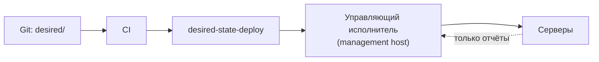
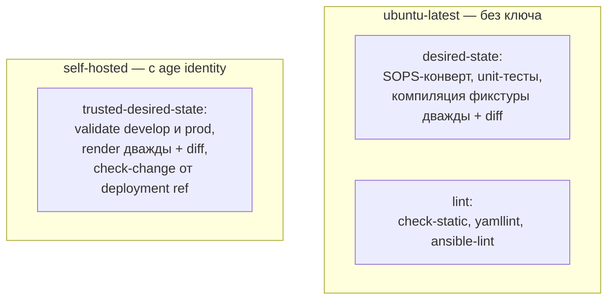
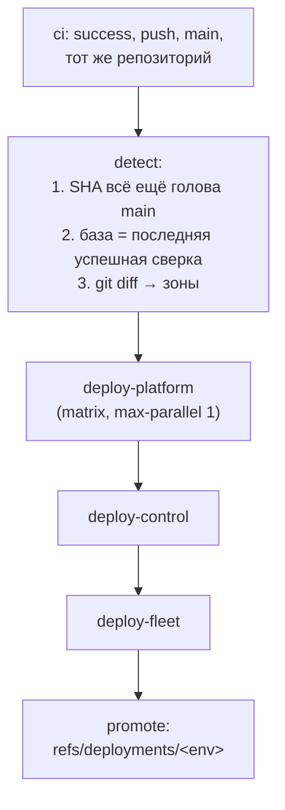
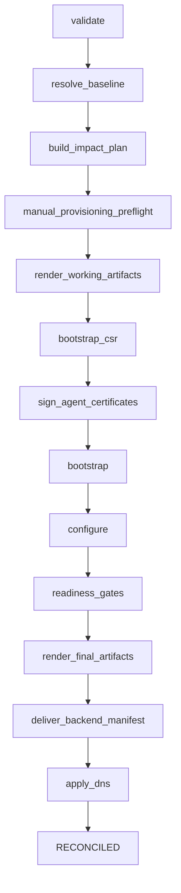

# Архитектура

Техническое описание репозитория: что где лежит, что чем управляется, как
устроен CI/CD и какие каталоги создаются при первоначальном бутстрапе.

## 1. Направление изменений



Обратной записи нет: фактическое состояние серверов читается для проверок
готовности и отчётов о расхождениях и не становится желаемым состоянием.

## 2. Структура репозитория

| Путь | Содержимое |
|---|---|
| `desired/` | Желаемое состояние: топологии сред, общие параметры, реестр ID флотов. Зашифровано SOPS |
| `contracts/` | JSON Schema объектов желаемого состояния, protobuf-контракты manifest и NodeAgent |
| `fleetctl/` | Python-пакет: валидация, компиляция, планирование, координатор развёртывания, PKI |
| `roles/` | Ansible-роли |
| `playbooks/` | Ansible-плейбуки |
| `inventories/bootstrap/` | `platform.sops.yml` — SOPS-контракт управляющей платформы и раннера |
| `scripts/` | Точки входа для операторов, CI и управляющего исполнителя |
| `.github/workflows/` | CI, выкатка, релизы |
| `tests/` | Модульные тесты, синтетические фикстуры |
| `build/` | Скомпилированные артефакты. Производное, не коммитится |

## 3. Желаемое состояние

### Раскладка

```
desired/
├── common/                     общие параметры, все скаляры зашифрованы
│   ├── components.yml          образы: repository / tag / digest
│   ├── limits.yml
│   ├── networking.yml
│   ├── observability.yml
│   ├── rollout.yml
│   └── xray.yml
├── environments/
│   ├── develop/topology.sops.yml
│   └── prod/topology.sops.yml
└── fleet-ids.yml               append-only: fleet id → vpn_fleet_id
```

### Формат окружения

Окружение — один документ `EnvironmentTopology` (`apiVersion: spiritvpn.io/v1alpha1`).
Объекты вложены в `spec.objects`. Свободностоящий объект в каталоге окружения —
ошибка загрузки `STANDALONE_OBJECT`.

| Kind | Схема | Назначение |
|---|---|---|
| `Environment` | `environment.schema.json` | DNS-зона, сеть управления, endpoint бэкенда, пути Vault, опционально `spec.control` |
| `Fleet` | `fleet.schema.json` | Списки `entries` / `exits`, мосты `bridges` |
| `LogicalNode` | `logical-node.schema.json` | Роль, регион, публичные параметры, REALITY, маскировка |
| `Instance` | `instance.schema.json` | Привязка логической ноды к машине: адрес, host key, профиль полосы, провайдер |

Имя файла обязано быть `topology.yml`, `topology.yaml`, `topology.sops.yml` или
`topology.sops.yaml`; `metadata.id` обязан совпадать с именем каталога.

### Шифрование

`.sops.yaml` задаёт три правила:

| Путь | `encrypted_regex` | Видимо в Git |
|---|---|---|
| `desired/environments/*/topology.sops.yml` | `^(spec)$` | Структура YAML, ключи, `metadata` |
| `desired/common/*.yml`, `desired/fleet-ids.yml` | — (все скаляры) | Имена файлов и ключей |
| `inventories/bootstrap/platform.sops.yml` | `^(inventory\|known_hosts\|vars)$` | Оболочка документа |

Получателей age три: восстановление оператором, управляющий исполнитель,
выделенный self-hosted runner.

`fleetctl` вызывает `sops --decrypt` с перехватом stdout; открытый текст на диск
не пишется. Ошибка расшифровки — `ValidationIssue`, а не мягкая деградация.

## 4. fleetctl

### Пакеты

| Пакет | Содержимое |
|---|---|
| `validation/` | `loader.py` — загрузка и JSON Schema; `semantic.py` — межобъектные правила; `service.py`, `issues.py` |
| `model/` | `objects.py` — типы объектов; `overrides.py` — `common_overrides`; `serialization.py` |
| `compiler/` | Проекции: `inventory`, `bootstrap`, `node_plans`, `control`, `dns`, `known_hosts`, `monitoring`, `addressing`, `backend_manifest`, `render` |
| `planning/` | `planner.py` — план влияния; `canonical.py` — канонический digest состояния |
| `deployment/` | `coordinator.py` — шаги выкатки и запись состояния; `revisions.py` |
| `adapters/` | `git`, `ansible`, `backend` (gRPC/mTLS), `cloudflare_dns`, `output` |
| `pki/` | Локальный CA, выпуск и подпись сертификатов |
| `provisioning/` | Проверка ручных объявлений VPS |
| `gen/` | Сгенерированный protobuf-код |

### Команды CLI

| Команда | Сеть | Действие |
|---|---|---|
| `validate` | нет | Схемы и семантика одного окружения |
| `render` | нет | Детерминированные артефакты в `--output` |
| `plan` | git | План влияния: источник против базы |
| `check-change` | git | CI-проверка перехода от deployment ref с компиляцией артефактов |
| `manifest` | нет | Манифест бэкенда, требует `--revision` |
| `ansible-check` | нет | Проверка скомпилированного инвентаря и планов нод |
| `provisioning-check` | нет | Проверка ручных объявлений VPS |
| `dns` | Cloudflare | Сверка или применение DNS |
| `deploy` | SSH, gRPC, Cloudflare | Координатор: bootstrap → configure → readiness → манифест → DNS |
| `update-deployment-ref` | git | Compare-and-swap `refs/deployments/<env>` |
| `pki-issue`, `pki-sign` | нет | Выпуск сертификата control-плоскости, подпись CSR ноды |

`plan` и `manifest` имеют два режима базы: `--baseline <dir>` (только тесты,
несовместим с `--source ≠ HEAD`) и штатный — `refs/deployments/<env>`.
`check-change` намеренно не принимает каталог базы: CI всегда проверяет именно
переход от последнего подтверждённого deployment ref к проверяемому SHA.

### Компилируемые артефакты

`render_files()` выдаёт JSON с `sort_keys=True` и `indent=2`:

| Файл | Потребитель |
|---|---|
| `ansible-inventory.json` | Группа `spiritvpn_fleet`, плейбук `deploy/configure.yml` |
| `bootstrap-inventory.json` | Группа `spiritvpn_bootstrap`, плейбуки `bootstrap/*` |
| `node-plans/<instance-id>.json` | Роль `compiled_node_plan`, устанавливается на ноду |
| `control-plan.json` | Только если объявлен `spec.control`. Плейбук `control/deploy.yml` |
| `dns-plan.json` | `fleetctl dns` |
| `known_hosts` | SSH-проверка при подключении к нодам |
| `monitoring-targets.json` | Роль `platform_observability` |
| `impact-plan.json` | Пишется командами `plan` / `deploy` отдельно от `render_files` |

## 5. Контракты

```
contracts/
├── desired-state/*.schema.json     JSON Schema Draft 2020-12
├── manifest/v1/manifest.proto      манифест инфраструктуры для бэкенда
└── nodeagent/v1/node_agent.proto   контракт NodeAgent
```

Схемы: `topology`, `environment`, `fleet`, `logical-node`, `instance` для
объектов; `components`, `networking`, `observability`, `rollout`, `xray`,
`limits`, `common-overrides` для `desired/common/`.

## 6. Ansible

### Плейбуки

| Плейбук | Хосты | Назначение |
|---|---|---|
| `platform/bootstrap.yml` | `spiritvpn_platform_bootstrap` | Первичная установка управляющего сервера |
| `platform/wireguard-bootstrap.yml` | — | Поднятие управляющего туннеля |
| `platform/steady.yml` | `localhost` | Постоянная сверка управляющего сервера |
| `platform/readiness.yml` | `localhost` | Проверки готовности платформы |
| `control/deploy.yml` | `localhost` | PostgreSQL, бэкенд, бот, цели мониторинга |
| `bootstrap/csr.yml` | `spiritvpn_bootstrap` | Сбор CSR с чистой ноды |
| `bootstrap/bootstrap.yml` | `spiritvpn_bootstrap` | Первичная настройка чистой ноды |
| `bootstrap/readiness.yml` | `spiritvpn_bootstrap` | Read-only проверки после бутстрапа |
| `deploy/configure.yml` | `spiritvpn_fleet` | Постоянная конфигурация traffic-нод |
| `operations/readiness.yml` | `spiritvpn_fleet` | Гейты готовности |

### Порядок ролей

| Плейбук | Роли по порядку |
|---|---|
| `platform/bootstrap.yml` | `platform_wireguard` → `docker` → `common` → `platform_vault` → `platform_executor` |
| `platform/steady.yml` | `platform_wireguard` → `docker` → `common` → `platform_vault` → `platform_netbird` → `platform_executor` → `platform_observability` |
| `bootstrap/bootstrap.yml` | `compiled_node_plan` (pre_task) → `docker` → `common` → `node_layout` → `bootstrap_wireguard` → `node_limits` → `pki_agent` |
| `deploy/configure.yml` | `common` → `docker` → `node_layout` → `node_limits` → `xray` → `nginx_mask` → `node_exporter` → `node_agent` → `compiled_runtime` |
| `control/deploy.yml` | `control_runtime` → `control_observability` |

## 7. CI/CD

### Процессы

| Workflow | Триггер | Раннер |
|---|---|---|
| `ci` | `pull_request`, `push` в `main` | `ubuntu-latest` + self-hosted |
| `desired-state-deploy` | `workflow_run` после успешного `ci` в `main` | `ubuntu-latest` + вызываемые |
| `platform-deploy` | `workflow_dispatch`, `workflow_call` | self-hosted |
| `control-deploy` | `workflow_dispatch`, `workflow_call` | self-hosted |
| `fleet-deploy` | `workflow_dispatch`, `workflow_call` | self-hosted + `ubuntu-latest` |
| `platform-readiness` | `workflow_dispatch` | self-hosted |
| `release-bump` | `repository_dispatch` | self-hosted |
| `runner-sops-bootstrap` | `workflow_dispatch` | self-hosted |

Self-hosted раннер помечен `[self-hosted, linux, spiritvpn-deploy]`.

### ci



`trusted-desired-state` выполняется только при `push`. Он проверяет
`id -un = github-runner` и права `600:github-runner` на
`$HOME/.config/spiritvpn/sops/age-identity.txt`, после чего экспортирует
`SOPS_AGE_KEY_FILE`.

Live topology остаётся входом тестов, а не golden fixture: тесты не перечисляют
текущие ID нод, IP и размеры флотов. Конкретный переход проверяет
`check-change`, поэтому изменение топологии не требует синхронной правки тестов.

Публичный раннер работает с `SPIRITVPN_SKIP_LIVE_DESIRED=1` и видит только
синтетические фикстуры.

### desired-state-deploy



Разбор диффа в `detect`:

| Изменённый путь | Зоны |
|---|---|
| `tests/*`, `docs/*`, `*.md` | игнорируется |
| `desired/environments/<env>/topology*.yml` | platform + control + fleet |
| `desired/environments/<env>/platform/*` | platform |
| прочее внутри `desired/environments/<env>/` | fleet |
| любой путь вне `desired/environments/` | все зоны для всех окружений |

`prod` вырезается из всех трёх списков. База сравнения — head последней успешной
сверки из API GitHub Actions; если её нет, берётся пустое дерево.

### fleet-deploy

```mermaid
sequenceDiagram
    participant R as self-hosted runner
    participant M as management host
    participant N as traffic-ноды
    participant B as backend
    participant D as Cloudflare DNS

    R->>R: checkout SHA, проверка ancestor main
    R->>R: git bundle: refs/spiritvpn/source<br/>+ refs/deployments/&lt;env&gt;
    R->>M: ssh forced command, bundle в stdin
    M->>M: bundle verify, fetch в bare repo, worktree
    M->>M: fleetctl deploy
    M->>N: bootstrap_csr → bootstrap → configure → readiness
    M->>B: манифест по mTLS
    B-->>M: APPLIED / IDEMPOTENT
    M->>D: reconcile полного desired DNS
    M-->>R: transcript
    R->>R: deployment-record.py: только RECONCILED → promote
    R->>R: update-deployment-ref + push --force-with-lease
```

`promote` — отдельный job на `ubuntu-latest` с `contents: write`. Ref двигается
compare-and-swap: ожидаемая база проверяется и передаётся в
`--force-with-lease`.

Автоматический вызов передаёт `resume=true`: для нового SHA запись создаётся,
а повтор того же SHA продолжает только незавершённые шаги. Это позволяет после
устранимой ошибки (например, Vault временно недоступен) довести тот же
коммит до конца без вспомогательного коммита.

### release-bump

Внешние репозитории шлют `repository_dispatch` с типами `control-release`,
`agent-release`, `bot-release`. Payload проверяется: `repository` обязан
совпасть с `^ghcr\.io/[a-z0-9._/-]+$`, digest — с `^sha256:[0-9a-f]{64}$`.
`scripts/topology-release.py bump` меняет только пины внутри
`desired/environments/<env>/topology.sops.yml`; изменение любого другого файла —
отказ. Для `develop` коммит пушится в `main` напрямую, для `prod` создаётся PR.

## 8. Управляющий исполнитель

Раннер подключается по SSH под пользователем `github-deploy`. Ключ в
`authorized_keys` привязан к forced command
`/usr/local/sbin/spiritvpn-github-command <bound-environment>`, который разбирает
`SSH_ORIGINAL_COMMAND` и через `sudo -n` вызывает одну из четырёх программ:

| Команда | Программа |
|---|---|
| `platform-readiness` | `/usr/local/sbin/spiritvpn-platform-readiness` |
| `platform-deploy <env> <sha> <check\|apply>` | `/usr/local/sbin/spiritvpn-platform-deploy` |
| `control-deploy <env> <sha> <check\|apply>` | `/usr/local/sbin/spiritvpn-control-deploy` |
| `fleet-deploy <env> <sha> <mode> <initial> <resume> <destructive>` | `/usr/local/sbin/spiritvpn-fleet-deploy` |

Запрошенное окружение обязано совпасть с окружением, к которому привязан ключ.

Приём bundle: `umask 077`, приём через `dd` под `ulimit -f` (256 MiB),
`git bundle verify`, проверка состава ref'ов и совпадения SHA, fetch в bare
repo, `git clone --no-checkout --shared` во временный worktree, `checkout
--detach`, проверка `git status --short` на пустоту. Временные файлы удаляются
в trap.

## 9. Координатор развёртывания

`fleetctl deploy` пишет запись состояния и проходит шаги:



В режиме `dry-run` шаги `bootstrap_csr`, `sign_agent_certificates`,
`bootstrap`, `configure`, `readiness_gates` помечаются `SKIPPED_DRY_RUN`; SSH не
выполняется.

Нода бутстрапится один раз за свою жизнь: факт фиксируется маркером в каталоге
`bootstrapped/` и не выводится из Git-диффа.

Обычные изменения выполняются одним коммитом в topology:

- смена IP той же машины сохраняет instance ID и классифицируется как
  `modification`;
- физическая замена обязана получить новый instance ID (смена provider resource
  или SSH host key под прежним ID запрещена) и классифицируется как
  `replacement`;
- новая логическая нода, её instance и включение во fleet могут появиться в
  одном коммите и классифицируются как `addition`.

Перед apply environment-scoped AppRole читает
`secret://kv/<env>/dns/cloudflare#api_token`; resolver материализует значение во
временный файл `0600` рядом с остальными входами executor, а `trap` удаляет его
при любом исходе. После readiness координатор сначала применяет backend
manifest, затем DNS. Ручной запуск без token-файла остаётся в
`WAITING_FOR_DNS`; повтор с `resume` не переотправляет уже принятый manifest.
Deployment ref двигается только для `RECONCILED`.

## 10. Каталоги при первоначальном бутстрапе

### Локальная машина оператора

| Путь | Создаёт | Содержимое |
|---|---|---|
| `ansible-env/` | Оператор вручную | venv с Ansible Core 2.18 |
| `/tmp/spiritvpn-ansible-local` | `scripts/platform-bootstrap.sh`, `0700` | `ANSIBLE_LOCAL_TEMP` |
| `~/.config/spiritvpn/keys/operator-wg.key` | Оператор | Приватный WireGuard-ключ оператора |
| `~/.config/spiritvpn/sops/age-identity.txt` | Оператор | age identity для SOPS |
| `~/.config/spiritvpn/pki/<env>/` | `make fleet-pki-issue`, `fleet-pki-sign` | Выпущенные сертификаты; переопределяется `PKI_OUTPUT` |
| `build/<env>/` | `make fleet-render` | Скомпилированные артефакты |

`CA_STATE` умолчания не имеет: путь к состоянию корневого CA задаётся явно.

### Self-hosted runner

| Путь | Содержимое |
|---|---|
| `$HOME/.local/spiritvpn/bin/sops` | Бинарь SOPS |
| `$HOME/.config/spiritvpn/sops/age-identity.txt` | age identity, `600:github-runner` |

### Управляющий сервер

Создаётся плейбуками `platform/bootstrap.yml` и `platform/steady.yml`.

| Путь | Владелец / режим | Роль |
|---|---|---|
| `/etc/wireguard` | `root` `0700` | `platform_wireguard` |
| `/etc/spiritvpn/platform` | `root` `0700` | `platform_executor` |
| `/etc/spiritvpn/platform/wireguard` | `root` `0700` | `platform_wireguard` |
| `/etc/spiritvpn/platform/wireguard/peers/{develop,prod}` | `root` `0700` | `platform_wireguard` |
| `/etc/spiritvpn/deploy` | `root` `0700` | `platform_executor` |
| `/etc/spiritvpn/deploy/{develop,prod}` | `root` `0700` | `platform_executor` |
| `/etc/spiritvpn/sops` | `root` `0700` | `platform_executor` |
| `/etc/spiritvpn/netbird` | `root` `0700` | `platform_netbird` |
| `/opt/spiritvpn/platform/executor` | `root` `0700` | `platform_executor` |
| `/opt/spiritvpn/platform/executor/incoming` | `root` `0700` | Приём bundle и временные worktree |
| `/opt/spiritvpn/platform/executor/build` | `root` `0700` | Скомпилированные артефакты по окружениям |
| `/opt/spiritvpn/platform/executor/venv` | `root` | Изолированный Python для `fleetctl` и Ansible |
| `/opt/spiritvpn/platform/vault/{config,config/policies,pki,tls,data,audit,snapshots}` | смешанный, `0700`–`0750` | `platform_vault` |
| `/opt/spiritvpn/platform/observability/{,targets,rules,grafana,alertmanager,loki,alloy}` | `root` `0755` | `platform_observability` |
| `/opt/spiritvpn/platform/observability/targets/<env>` | `root` `0755` | По одному каталогу целей на окружение |
| `/var/lib/spiritvpn/fleetctl` | `root` `0700` | Состояние координатора |
| `/var/lib/spiritvpn/observability` | uid Prometheus `0700` | Данные Prometheus |
| `/var/lib/spiritvpn/{grafana,alertmanager,loki,alloy}` | соответствующие uid, `0700` | Данные коллекторов |
| `/var/lib/spiritvpn/netbird`, `/var/lib/spiritvpn/netbird-client` | `root` `0700` | `platform_netbird` |
| `/home/github-deploy/.ssh` | `github-deploy` `0700` | `authorized_keys` с forced command |

Состояние координатора внутри `/var/lib/spiritvpn/fleetctl` (`0700` на каждом):

```
/var/lib/spiritvpn/fleetctl/
├── deployment-records/     записи выкаток
├── manifest-revisions/     ревизии манифеста бэкенда
└── bootstrapped/           маркеры «нода бутстрапнута»
```

Симлинк на месте любого из этих каталогов — отказ.

Каталоги control-плоскости создаёт роль `control_runtime` по путям из
`control-plan.json`:

| Путь | Владелец / режим |
|---|---|
| `/opt/spiritvpn/control/<env>` | `root` `0700` |
| `/opt/spiritvpn/control/<env>/secrets` | `root:<backend gid>` `0750` |
| `/opt/spiritvpn/control/<env>/bot` | `root` `0700` |
| `/opt/spiritvpn/control/<env>/bot/secrets` | `root:<bot gid>` `0750` |
| `/var/lib/spiritvpn/control/<env>/postgres` | uid PostgreSQL `0700` |
| `/var/lib/spiritvpn/control/<env>/backups` | `root` `0700` |

### Traffic-нода

Создаётся `bootstrap/bootstrap.yml`, затем поддерживается `deploy/configure.yml`.

| Путь | Владелец / режим | Роль |
|---|---|---|
| `/etc/spiritvpn` | `root` `0750` | `node_layout` |
| `/etc/spiritvpn/node-plan.json` | `root` `0640` | `node_layout` |
| `/var/lib/spiritvpn` | `root` `0750` | `node_layout` |
| `/var/log/spiritvpn` | `root` `0750` | `node_layout` |
| `/opt/vpn` | `root` `0755` | `node_layout` |
| `/opt/spiritvpn` | `root` `0755` | `node_layout` |
| `/etc/wireguard` | `root` `0700` | `bootstrap_wireguard` |
| `/var/lib/spiritvpn/pki` | `root` `0700` | `pki_agent` |
| `/home/<deploy user>/.ssh` | deploy-пользователь `0700` | `common` |
| `/opt/vpn/xray` | `root:<node agent gid>` `0770` | `xray`, права выдаёт `node_agent` |
| `/opt/vpn/xray/config.json` | `root:<node agent gid>` `0660` | `node_agent` |
| `/var/lib/xray` | `root` `0700` | `xray` |
| `/var/log/xray` | `root` `0750` | `compiled_runtime` |
| `/opt/vpn/nginx`, `/opt/vpn/nginx/{site,certs}` | `root` `0755` | `nginx_mask` |
| `/opt/vpn/node-agent` | `root:<node agent gid>` `0750` | `node_agent` |
| `/opt/vpn/node-agent/tls` | `root:<node agent gid>` `0750` | `node_agent` |
| `/var/lib/spirit-agent` | uid/gid NodeAgent `0700` | `node_agent` |
| `/opt/vpn/alloy` | `root` `0755` | `compiled_runtime` |
| `/var/lib/spiritvpn/alloy` | `root` `0700` | `compiled_runtime` |

## 11. Ключи и секреты

| Материал | Где живёт |
|---|---|
| age identity управляющего исполнителя | `/etc/spiritvpn/sops/age-identity.txt`, `root` `0600`, генерируется на месте через `age-keygen` |
| age identity раннера | `$HOME/.config/spiritvpn/sops/age-identity.txt`, `600:github-runner` |
| age identity восстановления | Вне репозитория и вне серверов |
| Секреты флота | Vault; в Git — только ссылки `secret://` |
| Секреты бэкенда и бота | Vault; в Git не объявлены |
| Приватные ключи машин | Только на соответствующей машине |
| SSH-ключ раннера к управляющему серверу | Секрет GitHub `PLATFORM_SSH_PRIVATE_KEY`, на раннере — только во временном файле job |
| Токен пуша релизов | Секрет GitHub `INFRA_PUSH_TOKEN` |
| Применённая база флота | `refs/deployments/<env>` |
