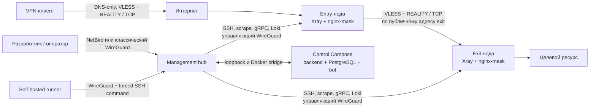
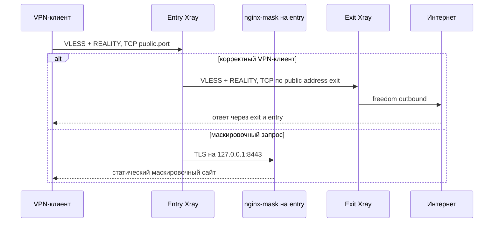
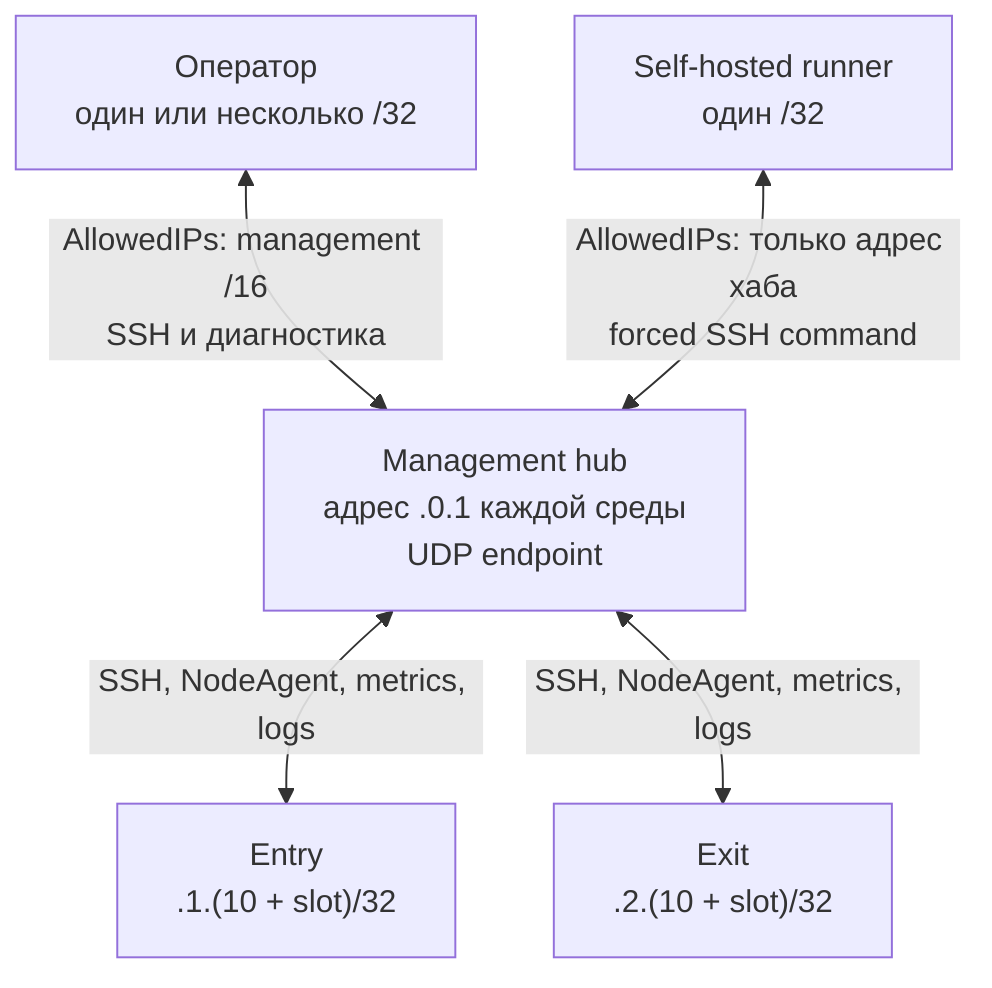
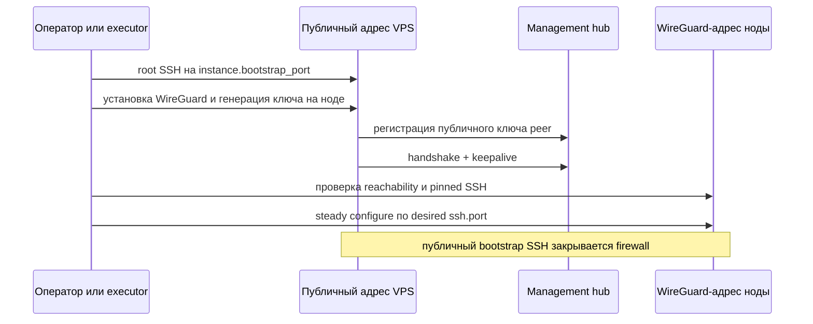
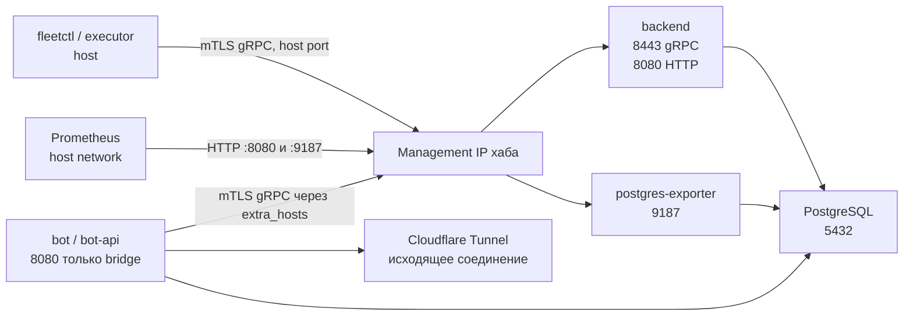

# Нетворкинг SpiritVPN

Документ описывает сетевую модель сервиса: публичный data plane, управляющий WireGuard, операторский NetBird,
сети Docker, firewall и доступ разработчиков. Конкретные публичные адреса,
домены и часть портов находятся в SOPS-зашифрованном desired state, поэтому
ниже используются имена полей и формулы, а не значения действующих сред.

## 1. Краткая модель

В проекте есть несколько независимых плоскостей с
разными задачами и границами доверия.

| Слой | Назначение | Основные технологии |
|---|---|---|
| Публичный data plane | Приём VPN-клиентов и передача трафика `entry → exit` | Xray, VLESS, TCP, REALITY, XTLS Vision, nginx-mask |
| Управляющая сеть флота | SSH, NodeAgent, метрики, логи, выкатка | WireGuard, IPv4 `/16`, gRPC/mTLS, HTTP |
| Операторский overlay | Более удобное подключение операторов к хабу | NetBird, WireGuard, STUN, relay, ACL, nginx TLS proxy |
| Сеть сервисов хаба | Связь backend, PostgreSQL, bot и tunnel | Docker Compose bridge, host-published ports |
| Локальная сеть процесса | Неэкспортируемые API, метрики и healthcheck | loopback `127.0.0.1` |
| Публичный ingress bot | Доступ пользователей к Mini App без входящего порта на хабе | исходящий Cloudflare Tunnel |

Технологический стек по уровням:

| Область | Стек |
|---|---|
| ОС и фильтрация | Linux, nftables, sysctl, conntrack, fail2ban |
| Overlay | WireGuard через `wg-quick`; NetBird с WireGuard, STUN и relay |
| VPN data plane | Xray, VLESS, REALITY, XTLS Vision, TCP |
| Service RPC | gRPC, Protocol Buffers, TLS 1.3, mutual TLS, SPIFFE URI identities |
| Контейнерная сеть | Docker Engine, Docker Compose, host network и bridge/NAT |
| Наблюдаемость | Prometheus, node-exporter, Alloy, Loki, Grafana, Alertmanager |
| Control plane | Backend, PostgreSQL, postgres-exporter, bot, Cloudflare Tunnel |
| Доступ и секреты | OpenSSH, SOPS, age, Vault PKI/KV, GitHub Actions runner |
| Публичные имена | Cloudflare DNS в режиме DNS-only |

Ноды, backend, Prometheus, Alloy и deployment executor общаются через классический WireGuard. NetBird является отдельным
операторским overlay и сам использует WireGuard как peer-to-peer транспорт.

## 2. Адресные пространства и DNS

### 2.1. Публичные адреса

Каждый `Instance` содержит `spec.public_address`. Каждый `LogicalNode`
объявляет публичные `hostname`, `port`, `server_name` и параметры REALITY.
Публичный адрес нужен для двух путей:

- VPN-клиент подключается к entry-ноде;
- entry-нода подключается к связанным exit-нодам.

`fleetctl/compiler/dns.py` создаёт для serving-инстансов записи `A` или `AAAA`.
Адаптер Cloudflare требует режим DNS-only (`proxied: false`); Cloudflare не
терминирует и не проксирует Xray-трафик. Если у control объявлен публичный
endpoint хаба, для него также создаётся прямая DNS-only запись.

### 2.2. Управляющие сети WireGuard

Для каждой среды объявлена отдельная IPv4-сеть `management_network` с префиксом
`/16`. Пусть её адрес равен `A.B.0.0/16`. Компилятор детерминированно назначает:

| Объект | Адрес |
|---|---|
| Management hub среды | `A.B.0.1` — первый host сети |
| Entry instance со slot `N` | `A.B.1.(10 + N)` |
| Exit instance со slot `N` | `A.B.2.(10 + N)` |
| Оператор | Явно выданный уникальный `/32` внутри одной из management-сетей |
| Self-hosted runner | Явно выданный `/32` из верхнего `/24` management-сети |

Slot берётся из последнего числового фрагмента `Instance.metadata.id`.
Адресация реализована в `fleetctl/compiler/addressing.py` и проверяется
семантической валидацией и unit-тестами.

Хаб держит адреса обеих сред на одном WireGuard-интерфейсе. Нода получает один
`/32`, а в `AllowedIPs` её peer хаба получает всю `/16` своей среды. Благодаря
включённому `net.ipv4.ip_forward=1` и правилу forward `wg → wg` хаб также
маршрутизирует операторский трафик к нодам.

### 2.3. Сеть NetBird

`platform_netbird_network` — отдельная overlay-сеть. Она не обязана совпадать с
management `/16` WireGuard. Диапазон выдаёт NetBird tenant, а роль проверяет,
что адрес интерфейса хаба `wt0` попал именно в объявленную сеть.

Адреса NetBird динамические и не участвуют в формулах `fleetctl`. Setup key,
peer roster, routes и ACL являются runtime-состоянием NetBird, а не частью
desired state этого репозитория.

### 2.4. Внутренние имена

Внутренние имена не публикуются в DNS:

- backend: значение host из `Environment.spec.backend_endpoint`;
- NodeAgent: `<instance>.agent.<environment>.internal`;
- Vault: по умолчанию `vault.management.internal`;
- Grafana: `grafana.management.internal` в операторской записи `/etc/hosts`.

Bot-контейнер получает backend-имя через Compose `extra_hosts`, указывающее на
management-адрес хаба. Для оператора `scripts/operator-access.py hosts`
генерирует строку `/etc/hosts` для Vault и Grafana. Это сделано вместо отдельной
внутренней DNS-службы.

## 3. Публичный data plane

### 3.1. Приём клиента

Xray слушает `0.0.0.0:<logical_node.public.port>` и принимает VLESS поверх
транспорта из `logical_node.public.transport` с REALITY. Публичный firewall
открывает только этот TCP-порт. REALITY направляет маскировочный трафик в nginx
на `127.0.0.1:8443`; nginx не доступен с сети напрямую.

Транспорт задаёт flow. У `tcp` это `xtls-rprx-vision`; у `xhttp` flow пуст, и
дополнительно объявляются `public.xhttp.path` и `public.xhttp.mode`. Inbound
рендерится с `mode: auto`, принимающим клиента в любом режиме, а объявленный
`mode` уезжает в клиентскую ссылку. Транспорт ноды выбирается независимо от
транспорта её бриджей: outbound на exit собирается по транспорту самой
exit-ноды.

Обе роли, entry и exit, имеют публичный VLESS inbound. Entry обслуживает
пользователей и выбирает exit; exit принимает инфраструктурную bridge-учётную
запись от entry и выпускает трафик наружу.

### 3.2. Маршрут entry → exit

Связи компилируются из `Fleet.spec.bridges`. Для каждого bridge entry получает:

- публичный IP serving-инстанса exit, а не management-адрес;
- публичный порт exit;
- REALITY server name, public key, short ID и fingerprint;
- отдельную service credential из Vault.

Значит межнодовый пользовательский трафик не идёт через management hub и не
использует управляющий WireGuard. Entry устанавливает второе публичное
VLESS+REALITY соединение прямо с exit.

NodeAgent динамически управляет пользователями и таблицей egress в Xray через
локальный API `127.0.0.1:10085`. Базовый конфиг запрещает маршрутизацию к
приватным, loopback, link-local, multicast и documentation-сетям. На exit
разрешённый трафик выходит через Xray `freedom` outbound.

## 4. Управляющий WireGuard

### 4.1. Топология

Это hub-and-spoke overlay с дополнительной маршрутизацией через хаб.

Хаб имеет публичный UDP listener. Нода также рендерит `ListenPort`, но
инициирует соединение к endpoint хаба и отправляет `PersistentKeepalive`.
Firewall ноды не открывает этот UDP-порт для новых входящих соединений; ответы
хаба проходят как `established`. У peer ноды на хабе нет `Endpoint`: хаб узнаёт
его из входящего handshake.

Ключи распределены без передачи приватного материала:

- приватный ключ хаба генерируется и хранится на хабе;
- приватный ключ ноды генерируется на ноде;
- приватный ключ оператора создаётся на машине оператора;
- приватный ключ runner создаётся на runner;
- Git/SOPS хранит только публичные ключи и адресные назначения.

### 4.2. Что идёт через этот overlay

| Источник | Получатель | Протокол | Защита приложения |
|---|---|---|---|
| Management hub | Нода | SSH на desired `networking.ssh.port` | SSH keys + pinned `known_hosts` |
| Backend на хабе | NodeAgent | gRPC на desired `networking.agent.port` | mTLS, SPIFFE identity среды |
| Prometheus на хабе | node-exporter | HTTP на desired `observability.ports.node_exporter` | bind + firewall, без app auth |
| Prometheus на хабе | NodeAgent metrics | HTTP на desired `observability.ports.agent_metrics` | bind + firewall, без app auth |
| Alloy ноды | Loki на хабе | HTTP `:3100/loki/api/v1/push` | WireGuard + firewall, без Loki auth |
| Оператор | Хаб и ноды | SSH, Grafana, Vault | source `/32`, SSH/TLS/app login |
| Runner | Хаб | SSH | отдельный key + forced command |

NodeAgent разрешает клиентскую SPIFFE identity только вида
`spiffe://spiritvpn/<environment>/service/backend`. Сертификат самой ноды имеет
identity `spiffe://spiritvpn/<environment>/instance/<instance>`, а TLS server
name компилируется отдельно. Поэтому один лишь сетевой доступ к agent-порту не
даёт права управлять Xray.

### 4.3. Bootstrap и переход на steady state

У ноды bootstrap inventory использует публичный адрес, `root` и
`instance.bootstrap_port` с default `22`. Во время bootstrap firewall временно
оставляет и bootstrap-порт, и новый desired SSH-порт, чтобы Ansible не оборвал
собственное соединение. Steady inventory использует management-адрес и только
desired SSH-порт; доступ ограничивается `/16` среды.

У хаба bootstrap также двухфазный: сначала поднимается WireGuard, затем
проверяется SSH через него, и только после этого применяется hardening.
`--reuse-tunnel` применяет изменившийся access contract уже через существующий
туннель.

## 5. NetBird и его связь с WireGuard

### 5.1. Состав self-hosted NetBird

Роль `platform_netbird` разворачивает на management hub четыре контейнера:

| Контейнер | Роль | Сеть |
|---|---|---|
| `netbird` | Combined Management, Signal, Relay, встроенный IdP, SQLite store, STUN | `network_mode: host` |
| `dashboard` | Web UI | Docker bridge, опубликован только на `127.0.0.1:8080` |
| `proxy` | TLS termination и мультиплексирование HTTP, WebSocket и gRPC | `network_mode: host` |
| `client` | Делает сам хаб peer собственной NetBird-сети | `network_mode: host`, интерфейс `wt0` |

Образы закреплены по digest. Конфигурация роли сверена в комментариях с
NetBird v0.76.3. Внешний nginx принимает TLS на TCP 443 и направляет:

- `/management.*` и `/signalexchange.*` как gRPC;
- `/relay` и `/ws-proxy/` как WebSocket;
- `/api` и `/oauth2` как HTTP;
- остальные запросы в dashboard.

UDP 3478 используется STUN и не проходит через nginx. Если прямое соединение
peer-to-peer невозможно, NetBird использует relay, доступный через тот же
публичный TLS endpoint. Сам туннель между peer'ами основан на WireGuard; NetBird
добавляет discovery, NAT traversal, relay, регистрацию peer'ов и ACL.

### 5.2. Роль в этом проекте

NetBird предназначен для операторского доступа к управляющим поверхностям
хаба. Сервер NetBird не является peer своей сети, поэтому отдельный client
контейнер поднимает на хабе `wt0`.

При этом текущий репозиторий не устанавливает NetBird client на fleet-ноды и
не переводит через NetBird следующие потоки:

- хаб → нода по SSH;
- backend → NodeAgent;
- Prometheus → метрики нод;
- нода → Loki;
- self-hosted runner → deployment executor.

Все они остаются на классическом management WireGuard. `node-agent` проекта и
`netbird client` — разные компоненты: первый управляет Xray и обслуживает gRPC
backend, второй создаёт сетевой peer.

### 5.3. Граница ответственности ACL

NetBird client вставляет раннее разрешающее nftables-правило для интерфейса
`wt0` и восстанавливает его через netlink monitor. Поэтому правила host
firewall, добавленные ниже, не могут надёжно ограничить NetBird peer'ов.
Фактическая граница доступа внутри этого overlay — ACL NetBird.

ACL, routes, users и peer roster в этом репозитории не декларативны: они живут
в зашифрованном SQLite store NetBird и настраиваются через dashboard/API.
Setup key client-контейнера хаба также создаётся после старта сервера и хранится
локальным root-only файлом.

Из этого следуют два ограничения:

1. До добавления fleet-ноды в NetBird необходимо создать ACL, иначе host
   firewall не изолирует её от слушателей хаба.
2. Grafana и Vault в playbook привязаны к management-адресу классического
   WireGuard, а не к адресу `wt0`. Репозиторий не объявляет NetBird route к этой
   сети. Поэтому end-to-end доступ к ним через NetBird зависит от runtime route
   и ACL и не может быть доказан одним Git checkout. Полностью описанный в Git
   резервный путь — классический WireGuard.

## 6. Firewall и маршрутизация хостов

### 6.1. nftables

Роль `common` управляет собственной таблицей `inet spiritvpn_filter`, не делая
`flush ruleset`, чтобы не удалить Docker NAT. Политики:

- `input`: `drop`;
- `forward`: `drop`;
- `output`: `accept`, кроме публичных ICMP echo-request.

Всегда разрешены loopback и `established,related`. Публичные и ограниченные
порты добавляются отдельными правилами. SSH защищён также fail2ban.

На fleet-нодах:

- публично разрешён только TCP-порт Xray;
- SSH, NodeAgent и routable metrics разрешены только из management `/16` через
  WireGuard-интерфейс;
- публичных UDP-портов нет;
- ping разрешён только внутри management-сети.

На хабе:

- WireGuard-интерфейс не считается полностью доверенным;
- SSH разрешён operator/runner `/32`, а также отдельным reviewed
  `platform_ssh_allowed_cidrs`;
- Grafana и Vault разрешены только operator `/32` классического WireGuard;
- Loki разрешён management `/16` обеих сред;
- транзит `wg → wg` разрешён отдельно от входа на сам хост;
- Docker bridge может инициировать исходящие соединения;
- DNAT опубликованного backend разрешён только с локальных Docker bridge.

Строгий reverse-path filtering намеренно не включается: он ломал бы overlay и
асимметричные маршруты. IPv4 forwarding сохраняется включённым для WireGuard
hub и Docker.

### 6.2. Docker networking

Все сервисы fleet-ноды используют `network_mode: host`: Xray, nginx-mask,
node-exporter, Alloy и NodeAgent. Поэтому bind-адрес каждого процесса является
реальной сетевой границей хоста.

Большинство платформенных сервисов хаба также используют host networking:
Prometheus, Alertmanager, node-exporter, Loki, Alloy, Grafana, NetBird server и
его proxy/client. Vault использует опубликованные порты с явными bind-адресами.

Control stack — исключение. Он использует Compose bridge `control` с
`internal: false`. Firewall разрешает контейнерам исходящий трафик, но не
разрешает произвольный вход в bridge. Host-published backend-порты отдельно
обрабатываются и для Docker userland proxy, и для DNAT-пути.

## 7. Порты и достижимость

В таблицах «публично» означает новый входящий пакет с интернета, прошедший
nftables. Наличие socket на `0.0.0.0` ещё не означает публичную достижимость.

### 7.1. Публичные порты management hub

| Порт | Протокол | Доступ | Назначение |
|---|---|---|---|
| `platform_netbird_listen_port`, default `443` | TCP/TLS | Интернет | NetBird dashboard, Management, Signal и Relay через nginx |
| `platform_netbird_stun_port`, default `3478` | UDP | Интернет | NetBird STUN |
| `platform_wireguard_listen_port` | UDP | Интернет | Endpoint классического management WireGuard |
| `ansible_port`, обычно `22` | TCP/SSH | Только `platform_ssh_allowed_cidrs`; overlay `/32` имеют отдельные правила | Bootstrap/break-glass и управление хабом |

Bot не открывает входящий порт на хабе: `bot-tunnel` сам устанавливает исходящее
соединение в Cloudflare Tunnel.

### 7.2. Публичные порты fleet-ноды

| Порт | Bind | Доступ | Назначение |
|---|---|---|---|
| `logical_node.public.port` | `0.0.0.0` | Интернет | Xray VLESS + REALITY |
| `instance.bootstrap_port`, default `22` | sshd | Интернет только во время первого bootstrap | Первичный root SSH |
| `networking.ssh.port` | sshd | После bootstrap только management `/16` | Steady SSH |
| `networking.management.listen_port` | WireGuard socket | Не открыт для новых входящих UDP-пакетов | Нода сама инициирует tunnel к хабу |

### 7.3. Listener'ы fleet-ноды

| Сервис | Адрес и порт | Кто обращается |
|---|---|---|
| NodeAgent gRPC | `<node-management-ip>:networking.agent.port` | Backend через WireGuard; mTLS обязательно |
| NodeAgent metrics/health | `<node-management-ip>:observability.ports.agent_metrics` | Prometheus и readiness через WireGuard |
| node-exporter | `<node-management-ip>:observability.ports.node_exporter` | Prometheus через WireGuard |
| Xray metrics | `127.0.0.1:observability.ports.xray_metrics`, role default `11111` | Локальная диагностика; central Prometheus их не scrapes |
| Xray gRPC API | `127.0.0.1:10085` | NodeAgent и healthcheck Xray |
| nginx-mask | `127.0.0.1:8443` | REALITY fallback Xray |
| Alloy UI | `127.0.0.1:12345` | Только локально |

### 7.4. Listener'ы management hub

| Сервис | Адрес и порт | Достижимость |
|---|---|---|
| Grafana | `<develop-hub-management-ip>:3000` | Operator `/32` классического WireGuard; login обязателен |
| Vault API/UI | `127.0.0.1:8200` и `<develop-hub-management-ip>:8200` | Локальные процессы и operator `/32`; TLS 1.3 |
| Vault Raft | `127.0.0.1:8201` | Только локально, кластер одноузловой |
| Backend gRPC | `<environment-hub-ip>:backend_endpoint.port` → container `8443` | Хост и локальный Docker bridge; mTLS |
| Backend HTTP/metrics | `<environment-hub-ip>:8080` | Prometheus на хабе; без TLS и caller auth |
| postgres-exporter | `<environment-hub-ip>:9187` | Prometheus на хабе |
| PostgreSQL | Только `control` bridge, обычно container `5432` | Backend, migrations, exporter и bot в Compose |
| Prometheus | `127.0.0.1:9090` | Только локально; UI возможен через SSH tunnel |
| Alertmanager | `127.0.0.1:9093` | Только локально |
| node-exporter хаба | `127.0.0.1:9100` | Локальный Prometheus |
| Loki HTTP | `0.0.0.0:3100` | Loopback и management `/16` обеих сред через firewall |
| Loki gRPC | `127.0.0.1`, внутренний порт Loki | Только локально |
| Alloy UI | `127.0.0.1:12345` | Только локально |
| NetBird combined HTTP | настроено `127.0.0.1:8081`, фактически `*:8081` в проверенной версии | nginx через loopback; внешний вход блокирует firewall |
| NetBird dashboard | `127.0.0.1:8080` → container `80` | Только nginx |
| NetBird metrics | `*:9099` | Только локальный host благодаря firewall; порт нельзя объявлять public |
| NetBird health | `127.0.0.1:9000` | Ansible readiness |

NetBird combined server в проверенной версии игнорирует bind-часть
`listenAddress` и слушает `*:8081`; `metricsPort` также не принимает bind
address. Поэтому для этих двух портов firewall является единственной внешней
границей.

### 7.5. Control bridge

## 8. Матрица основных соединений

| Откуда | Куда | Адрес назначения | Сеть | Протокол и идентификация |
|---|---|---|---|---|
| VPN-клиент | Entry Xray | Public DNS/IP entry | Интернет | VLESS + REALITY, TCP |
| Entry Xray | Exit Xray | Public IP serving exit | Интернет | VLESS + REALITY, bridge credential |
| Exit Xray | Ресурс пользователя | Публичный адрес ресурса | Интернет | Обычный Xray freedom egress |
| Executor | Нода | Детерминированный management IP | WireGuard `/16` | SSH, pinned host key |
| Executor/fleetctl | Backend | Management IP хаба + backend port | Локальный host route | gRPC/mTLS, manifest-writer identity |
| Backend | NodeAgent | Management IP ноды + agent port | WireGuard `/16` | gRPC/mTLS, environment-bound SPIFFE |
| NodeAgent | Xray API | `127.0.0.1:10085` | Loopback ноды | Локальный gRPC API Xray |
| Prometheus | Метрики нод | Management IP ноды | WireGuard `/16` | HTTP, bind + nftables |
| Prometheus | Метрики control | Management IP хаба | Локальный host route | HTTP |
| Alloy ноды | Loki | Hub `.0.1:3100` своей среды | WireGuard `/16` | HTTP push |
| Alloy хаба | Loki | `127.0.0.1:3100` | Loopback | HTTP push |
| Bot | Backend | Internal backend name → hub management IP | Docker bridge → host | gRPC/mTLS |
| Bot tunnel | Cloudflare | Публичный endpoint Cloudflare | Исходящий интернет | Cloudflare Tunnel |
| Operator | Хаб/ноды | Management `/16` | Классический WireGuard | SSH, Grafana, Vault |
| NetBird peer | NetBird server/hub peer | Public 443/3478 и NetBird IP | Интернет + NetBird overlay | TLS/OIDC, WireGuard, ACL |
| Runner | Executor | Только management IP хаба | Классический WireGuard | SSH forced command |

## 9. Доступ разработчиков и CI

### 9.1. Классический операторский доступ

Будущий оператор локально запускает `operator-identity.py`. Скрипт создаёт три
независимые личности:

- age — для расшифровки SOPS desired state;
- SSH — для входа на хаб и ноды;
- WireGuard — для management overlay.

Наружу передаётся только запрос с публичными ключами. Действующий оператор
сверяет единый fingerprint вне исходного канала и запускает
`operator-access.py grant`. Изменение добавляет:

- age recipient в `.sops.yaml` и перешифровывает подходящие SOPS-файлы;
- SSH public key в операторский roster;
- WireGuard public peer с явно выбранным `/32`.

Скрипт ничего не применяет: изменение проходит commit, PR и CODEOWNERS review.
Access contract из `inventories/bootstrap/platform.sops.yml` затем применяется
отдельной защищённой процедурой через существующий tunnel. Отзыв удаляет все
три части; последнего оператора удалить запрещено.

После подключения оператор получает маршрут ко всей management `/16` своей
среды. Он может:

- заходить по SSH на хаб и ноды;
- открывать Grafana на `:3000` и Vault UI на `:8200` хаба;
- использовать SSH tunnel к loopback-only Prometheus или другим локальным UI;
- запускать проверенные deployment-процедуры.

Это root-equivalent операционная роль, а не ограниченный пользовательский
доступ: deploy user входит в `sudo` и `docker`, а изменения roster управляют
теми, кто может администрировать инфраструктуру.

### 9.2. Доступ через NetBird

Разработчик может зарегистрировать NetBird client на self-hosted сервере и
получить peer-to-peer доступ к client-интерфейсу хаба. Аутентификация dashboard
использует встроенный IdP; TLS завершается на nginx.

Но выдача NetBird user/peer, routes и ACL не автоматизирована Git-кодом этого
репозитория. Поэтому перед использованием необходимо проверить в NetBird
runtime:

1. peer разработчика состоит в нужной группе;
2. ACL разрешает только необходимые сервисы;
3. опубликован маршрут к management-адресу сервисов либо сервис слушает адрес
   NetBird хаба;
4. маршрут не даёт лишнего доступа к fleet-нодам и другим listener'ам хаба.

NetBird удобнее как identity-aware overlay, но сейчас не является заменой
процедуре выдачи age/SSH/WireGuard-доступа для инфраструктурного оператора.

### 9.3. Self-hosted runner

Runner получает отдельный WireGuard `/32` и `AllowedIPs` только для overlay-IP
хаба, а не всей `/16`. Он подключается пользователем `github-deploy`; его ключ
привязан к окружению и forced command. Допустимы только:

- `platform-readiness`;
- `platform-deploy <env> <sha> <check|apply>`;
- `control-deploy <env> <sha> <check|apply>`;
- `fleet-deploy <env> <sha> <mode> <initial> <resume> <destructive>`.

Runner не получает произвольную SSH-сессию. Для дальнейшего доступа к нодам
команду выполняет доверенный executor на хабе.

## 10. Границы ответственности

| Область | Источник истины | Что ему принадлежит |
|---|---|---|
| Топология среды | `desired/environments/<env>/topology.sops.yml` | Public IP, DNS zone, management `/16`, backend endpoint, node topology, bridges |
| Общая сеть | `desired/common/networking.yml` | WG interface/listen port/MTU/keepalive, SSH и agent ports, DNS policy |
| Наблюдаемость | `desired/common/observability.yml` | Порты node metrics, интервалы и retention |
| Публичный Xray | `LogicalNode` + `Fleet.bridges` | Hostname/port, REALITY, entry→exit связи |
| Доступ к платформе | `inventories/bootstrap/platform.sops.yml` | Hub WG, operator/runner peers, SSH keys/CIDRs, NetBird hostname/network/owner |
| Адреса и планы | `fleetctl/compiler/*` | Детерминированные IP, inventories, node/control plans, DNS и monitoring targets |
| Host networking | Ansible `roles/*`, `playbooks/*` | WireGuard configs, bind addresses, nftables, Docker networks |
| App-level trust | Vault/PKI + backend/NodeAgent configs | mTLS, SPIFFE identities, TLS server names |
| NetBird runtime | NetBird SQLite store и root-only setup key | Users, peers, setup keys, routes, ACL |
| Public DNS | Cloudflare API через `fleetctl dns` | DNS-only A/AAAA records; автоматического удаления нет |
| Bot ingress | Cloudflare Tunnel runtime credentials | Публичный HTTPS origin без listener на хабе |

Приватные WireGuard-ключи, Vault CA/state, NetBird setup key и runtime passwords
не являются Git-owned значениями. Git владеет правилами их создания,
расположением и публичными проекциями.

## 11. Файлы реализации

### 11.1. Контракты и компилятор

| Файл | Ответственность |
|---|---|
| `contracts/desired-state/networking.schema.json` | Схема management, SSH, agent и DNS параметров |
| `contracts/desired-state/environment.schema.json` | Management network, backend endpoint, control и bot ingress |
| `contracts/desired-state/logical-node.schema.json` | Публичный VLESS/REALITY endpoint |
| `contracts/desired-state/instance.schema.json` | Public address и bootstrap SSH port |
| `contracts/desired-state/observability.schema.json` | Порты метрик и интервалы |
| `fleetctl/compiler/addressing.py` | Формулы hub/node addresses и NodeAgent identities |
| `fleetctl/compiler/inventory.py` | Steady SSH через management address |
| `fleetctl/compiler/bootstrap.py` | Первый SSH через public address |
| `fleetctl/compiler/node_plans.py` | Node networking, entry→exit targets и Loki endpoint |
| `fleetctl/compiler/control.py` | Host/container ports control stack |
| `fleetctl/compiler/backend_manifest.py` | Публичные node endpoints и agent endpoints для backend |
| `fleetctl/compiler/monitoring.py` | Management scrape targets и проверка принадлежности сети |
| `fleetctl/compiler/dns.py` | DNS-only A/AAAA plan |
| `fleetctl/adapters/cloudflare_dns.py` | Fail-closed reconcile Cloudflare DNS |
| `fleetctl/adapters/backend.py` | Доставка manifest в backend по gRPC/mTLS |

### 11.2. Ansible и runtime

| Файл или каталог | Ответственность |
|---|---|
| `roles/common/templates/nftables.conf.j2` | Input/forward/output firewall |
| `roles/common/templates/sysctl-hardening.conf.j2` | Forwarding и совместимые с overlay sysctl |
| `roles/platform_wireguard/` | Hub WireGuard, operator/runner и динамические node peers |
| `roles/bootstrap_wireguard/` | Node-local keys, peer registration и spoke config |
| `roles/xray/` | VLESS/REALITY listeners, outbounds, private-network blocking |
| `roles/nginx_mask/` | Loopback TLS mask site |
| `roles/node_agent/` | Agent bind, PKI и доступ к локальному Xray |
| `roles/compiled_runtime/` | Host-network Compose ноды и Alloy shipping |
| `roles/control_runtime/` | Control bridge, published backend/metrics, bot tunnel |
| `roles/platform_vault/` | Loopback/overlay Vault listeners и TLS |
| `roles/platform_observability/` | Prometheus, Loki, Alloy, Grafana и Alertmanager |
| `roles/control_observability/` | file_sd fragments среды для общего Prometheus |
| `roles/platform_netbird/` | Self-hosted NetBird, nginx proxy, hub client |
| `playbooks/platform/bootstrap.yml` | Первичный hub firewall и WireGuard |
| `playbooks/platform/steady.yml` | Постоянные hub rules, NetBird и observability |
| `playbooks/bootstrap/bootstrap.yml` | Первичный node SSH и WireGuard |
| `playbooks/deploy/configure.yml` | Steady node runtime |
| `playbooks/operations/readiness.yml` | Listener, bind и reachability checks |

### 11.3. Доступ и автоматизация

| Файл | Ответственность |
|---|---|
| `scripts/bootstrap-platform.py` | Двухфазный bootstrap хаба через WireGuard |
| `scripts/operator-identity.py` | Локальная генерация age/SSH/WireGuard identity |
| `scripts/operator-access.py` | Grant/revoke и внутренние `/etc/hosts` записи |
| `scripts/platform-sops.py` | Валидация encrypted platform access contract |
| `scripts/enroll-runner-overlay.sh` | WireGuard config self-hosted runner |
| `scripts/platform-remote.sh` | Строго ограниченные remote deployment commands |
| `roles/platform_executor/` | Forced commands и выполнение exact-SHA deployment |
| `.github/workflows/platform-deploy.yml` | Доставка platform deploy на хаб |
| `.github/workflows/control-deploy.yml` | Доставка control deploy на хаб |
| `.github/workflows/fleet-deploy.yml` | Координация выкатки fleet через хаб |

## 12. Проверки и сетевые инварианты

| Тест или playbook | Что проверяет |
|---|---|
| `tests/unit/test_rendering.py` | Формулы адресов, management-only scrape targets, bootstrap/steady inventories |
| `tests/unit/test_bootstrap.py` | SSH-переход, WireGuard convergence, node bind addresses, Xray private routes |
| `tests/unit/test_platform_foundation.py` | Hub firewall, Docker bridge egress/DNAT, logs over overlay, metrics binds, Vault, runner |
| `tests/unit/test_operator_access.py` | Grant/revoke, уникальность `/32`, отзыв SOPS access |
| `tests/unit/test_cloudflare_dns.py` | DNS-only и границы зоны Cloudflare |
| `playbooks/bootstrap/readiness.yml` | Наличие management address после bootstrap |
| `playbooks/operations/readiness.yml` | Public listener, agent health, management-only metrics binds, Xray runtime |
| `playbooks/platform/readiness.yml` | Готовность Vault и платформенных сервисов |
| `roles/platform_netbird/tasks/main.yml` | TLS round trip, client join и совпадение tenant network |

Наиболее важные compile-time и deployment-time инварианты:

- central scrape target не может находиться вне management `/16`;
- лог endpoint ноды выводится из hub address management-сети;
- node metrics не могут слушать wildcard;
- Xray API и diagnostics остаются на loopback;
- backend и NodeAgent сертификаты обязаны иметь identity своей среды;
- serving node без pinned SSH host key не попадает в рабочий inventory;
- публичные DNS records обязаны оставаться DNS-only;
- NetBird internal HTTP и metrics ports запрещено добавлять в public ports;
- изменение platform access contract применяется отдельной fail-closed
  процедурой.

## 13. Существенные ограничения и риски

1. **Loki не имеет application authentication.** `auth_enabled: false`, а
   firewall разрешает TCP 3100 всей management `/16` каждой среды. nftables не
   различает HTTP push и query. Поэтому скомпрометированная fleet-нода может не
   только писать, но и читать доступные Loki API и подмешивать логи. Комментарий
   «открыт на запись» выражает назначение, но не техническое ограничение.

2. **ACL NetBird — runtime, а не Git-owned policy.** Host firewall пропускает
   трафик `wt0` до собственных ограничений. Ошибка ACL способна открыть peer'у
   больше listener'ов хаба, чем видно из playbook.

3. **Полный NetBird-маршрут разработчика не доказывается репозиторием.** Hub
   входит в NetBird, но Grafana/Vault bind'ятся к адресу классического
   WireGuard. Наличие route и ACL следует проверять в runtime.

4. **NetBird HTTP `8081` и metrics `9099` слушают wildcard.** Их закрывает
   только default-drop firewall. Ошибка в public port list превратит внутреннюю
   поверхность в публичную; роль содержит assert против этого.

5. **Metrics HTTP не аутентифицированы.** Защита node-exporter, agent metrics,
   backend metrics и postgres-exporter построена на точном bind и nftables.

6. **Публичная проверка нод неполна.** Monitoring plan компилирует external
   VLESS probe, но, согласно `README.md`, её пока не читает автоматический
   механизм. Readiness подтверждает listener и часть entry→exit reachability с
   хаба, но не полный путь внешнего клиента.

7. **DNS показывает origin.** Записи Xray и хаба намеренно DNS-only. Это нужно
   для протоколов и собственных TLS/REALITY endpoints, но не скрывает IP за
   Cloudflare proxy.

Эти ограничения не отменяют разделение плоскостей: публичный пользовательский
трафик не получает маршрута в management-сеть, а служебные endpoints не должны
публиковаться на внешнем интерфейсе. Они показывают места, где граница держится
не одним механизмом и требует отдельной проверки при изменениях.
